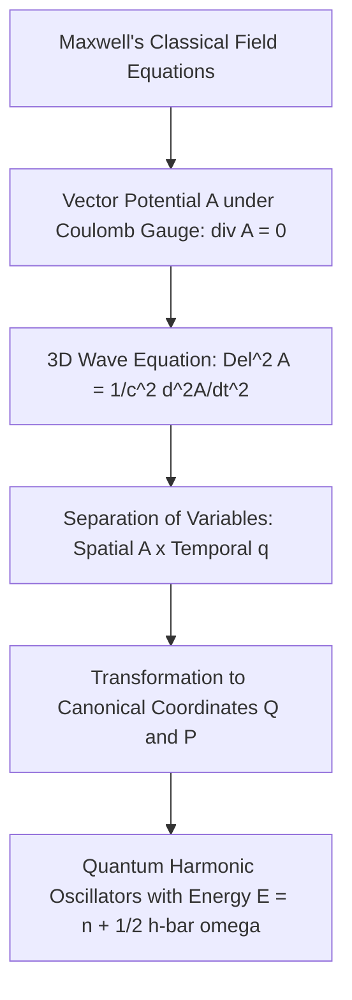

Here is an engaging, easy-to-understand, scene-by-scene AI video script designed to introduce the foundational concepts of Unit 4 (Advanced Quantum Mechanics: Light-Matter Interactions) to beginners. 

---

# Advanced Quantum Mechanics: How Light Meets Matter

## Conceptual Overview
Before diving into the scenes, let's look at the core relationships and components of the quantum system.

### The Total Hamiltonian Breakdown
The total energy operator of an atom in a radiation field is decomposed as follows:

$$\begin{array}{rcl} H & = & H_a + H_r + H' \\ & = & \left( \frac{\mathbf{p}^2}{2m} + V(\mathbf{r}) \right) + \frac{1}{2}\int(\epsilon_0 \mathbf{E}^2 + \mu_0 \mathbf{H}^2)d\tau + \left( -\frac{q}{m} \mathbf{A} \cdot \mathbf{p} \right) \end{array}$$

### Comparison of Quantum Light-Matter Scattering

| Scattering Type | Relative Energy | Wavelength Change ($\Delta \lambda$) | Physical Mechanism | Classical Limit Cross-Section |
| :--- | :--- | :--- | :--- | :--- |
| **Thomson Scattering** | Low Energy ($\hbar\omega \ll mc^2$) | No Change ($\Delta\lambda = 0$) | Elastic scattering of electromagnetic waves off free charges | $\sigma_{\text{Thom}} = \frac{8\pi}{3} r_0^2$ |
| **Compton Scattering** | High Energy ($\hbar\omega \approx mc^2$) | Increases ($\Delta\lambda > 0$) | Inelastic billiard-ball-like collision between photon and electron | $\sigma_{\text{Compton}} < \sigma_{\text{Thom}}$ (Klein-Nishina) |

### Conceptual Flow of Field Quantization

---

## Scene-by-Scene AI Video Script

### Scene 1: The Quantum Dance
* **Duration:** 30 seconds
* **Visual Prompt:** Cinematic 3D animation of a glowing hydrogen atom surrounded by swirling, colorful waves of light representing the electromagnetic field. The camera slowly orbits the atom. High-quality CGI, Unreal Engine 5 render, raytraced lighting, soft focus, deep depth of field. Clean text overlay: $H = H_a + H_r + H'$.
* **Narration:** 
  "Welcome to the quantum world! When light meets an atom, they engage in a beautiful, microscopic dance. To understand how they interact, physicists use a tool called the **Hamiltonian**, which represents the total energy of the system. It's split into three parts: the atom's own energy ($H_a$), the pure light field's energy ($H_r$), and the critical interaction term ($H'$)."

---

### Scene 2: The Vector Potential
* **Duration:** 30 seconds
* **Visual Prompt:** A split screen showing classical light waves on the left, transitioning into a stream of glowing, golden photon spheres on the right. Green vector arrows labeled $\vec{A}$ (Vector Potential) and purple arrows labeled $\vec{p}$ (momentum) float elegantly over the scene. Photorealistic, 8k resolution, cinematic scientific animation.
* **Narration:** 
  "To describe how light moves a charged electron, we use the **vector potential**, $\vec{A}$. In our quantum equations, the primary interaction is proportional to $\vec{A} \cdot \vec{p}$—where $\vec{p}$ is the electron's momentum. This simple combination tells us exactly how atoms absorb and emit packets of light!"

---

### Scene 3: Feynman Diagrams—The Language of Particles
* **Duration:** 30 seconds
* **Visual Prompt:** A clean, dark-mode digital environment. A glowing neon-blue line (an electron) and a wavy neon-yellow line (a photon) collide at a single point—a vertex—and bounce away. The drawing is a minimalist, glowing holographic 3D model.
* **Narration:** 
  "But how do we calculate these complex collisions? The legendary physicist Richard Feynman gave us a visual map: **Feynman Diagrams**. Solid lines represent matter, like electrons, and wavy lines represent photons. Where they meet is called a **vertex**—the exact moment they exchange energy!"

---

### Scene 4: The Art of Scattering
* **Duration:** 30 seconds
* **Visual Prompt:** Side-by-side comparative animation. On the left, a low-energy photon bounces off an electron without changing color (Thomson). On the right, a high-energy blue photon hits an electron, pushes it away, and bounces off as a red photon with longer wavelength (Compton). Highly educational, clear visual storytelling, 3D render.
* **Narration:** 
  "When light bounces off an electron, two things can happen. If the light's energy is low, it bounces off elastically without losing energy—this is **Thomson Scattering**. But at high energies, the photon kicks the electron, losing its own energy and changing its color. This is **Compton Scattering**!"

---

### Scene 5: Quantizing the Field
* **Duration:** 30 seconds
* **Visual Prompt:** A futuristic grid of glowing quantum harmonic oscillators, bobbing up and down like a matrix of interconnected springs. As they vibrate, little packets of light (photons) emerge and travel along the grid lines. High-tech sci-fi aesthetic, Octane Render, soft glowing particles, 4k.
* **Narration:** 
  "To truly quantize light, we treat Maxwell's electromagnetic field as a collection of tiny, invisible springs—**quantum harmonic oscillators**! Each oscillator can only vibrate at specific energy steps: 

  $$E = \left(n + \frac{1}{2}\right)\hbar\omega$$

  This mathematically proves that light isn't just a smooth wave; it is made of distinct packets of energy we call photons."

---

### Scene 6: The Ultimate Formula
* **Duration:** 30 seconds
* **Visual Prompt:** Breathtaking cosmic zoom-out from the quantum atomic scale up to a spinning galaxy, showing how these tiny quantum rules govern the behavior of light across the entire cosmos. Clean equations fade in and out of the stars. Deep, inspiring orchestral music reaches its peak.
* **Narration:** 
  "By mastering these equations—from the S-matrix to Feynman rules—we can predict how light and matter interact across the entire universe. Advanced quantum mechanics is the key to unlocking the technology of tomorrow!"