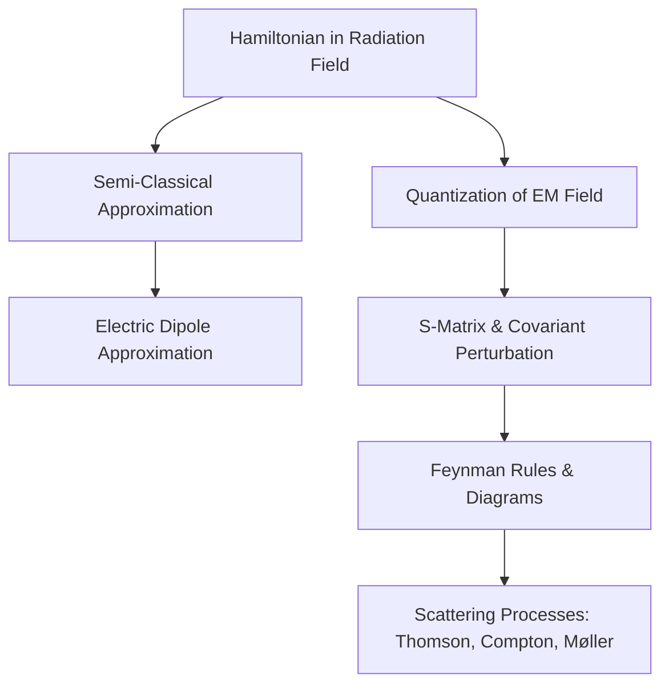
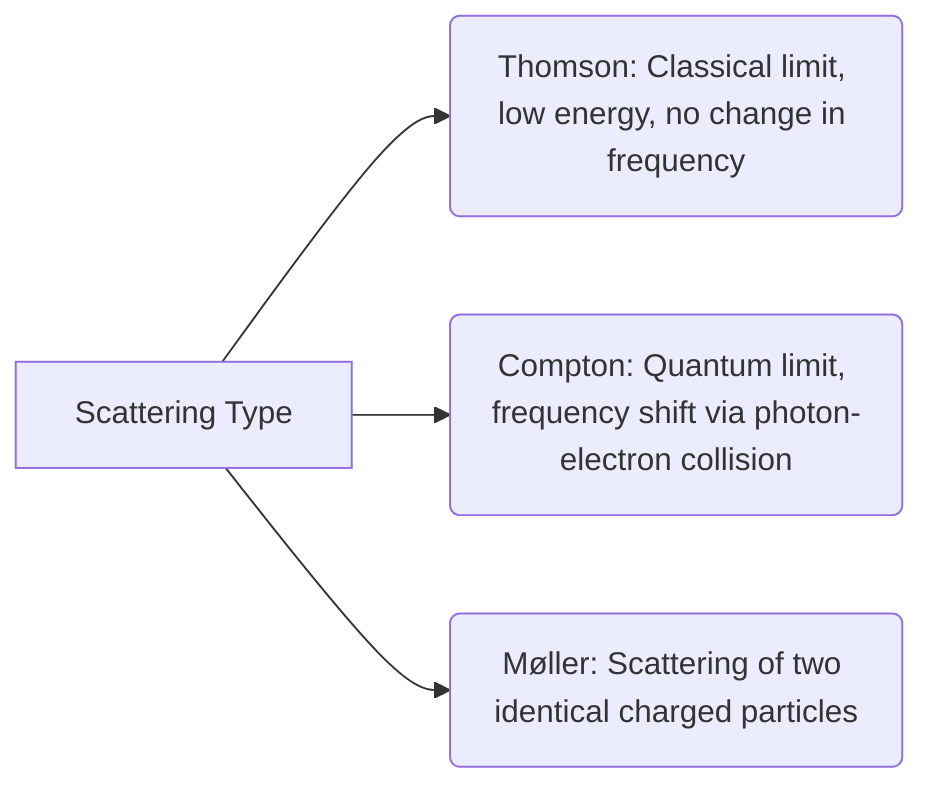

---

## 1. Chapter Overview

This unit focuses on the transition from classical electrodynamics to **Quantum Electrodynamics (QED)**. It covers the interaction of atomic systems with electromagnetic radiation, starting with a semi-classical approach and advancing to the full canonical quantization of the radiation field. Key physical processes such as **Thomson Scattering**, **Compton Scattering**, and **Møller Scattering** are derived and analyzed. Finally, the unit establishes the mathematical framework of the **S-Matrix** and **Feynman Diagrams**, which serve as the foundation for modern perturbative quantum field theory.



---

## 2. Key Concepts

### Concept 1: The Hamiltonian in a Radiation Field
For a non-relativistic electron of charge $q$ and mass $m$ moving in an atomic potential $V(\mathbf{r})$ under the influence of an electromagnetic radiation field described by vector potential $\mathbf{A}(\mathbf{r}, t)$ (with scalar potential $\Phi = 0$ in the Coulomb gauge), the total Hamiltonian is:

$$H = \frac{1}{2m} (\mathbf{p} - q\mathbf{A})^2 + V(\mathbf{r}) + H_r$$

Here, $H_r$ is the Hamiltonian representing the pure radiation field:

$$H_r = \frac{1}{2} \int \left( \epsilon_0 \mathbf{E}^2 + \mu_0 \mathbf{H}^2 \right) d\tau$$

#### Expansion of the Interaction Hamiltonian ($H'$)
Expanding the kinetic term:

$$H = \frac{1}{2m} \left( \mathbf{p}^2 - q(\mathbf{p}\cdot\mathbf{A} + \mathbf{A}\cdot\mathbf{p}) + q^2\mathbf{A}^2 \right) + V(\mathbf{r}) + H_r$$

Let the unperturbed atomic Hamiltonian be $H_a = \frac{\mathbf{p}^2}{2m} + V(\mathbf{r})$.
Using the **Coulomb Gauge** ($\nabla \cdot \mathbf{A} = 0$), the momentum operator $\mathbf{p} = -i\hbar\nabla$ commutes with the vector potential:

$$[\mathbf{p}, \mathbf{A}] = -i\hbar (\nabla \cdot \mathbf{A}) = 0 \implies \mathbf{p}\cdot\mathbf{A} = \mathbf{A}\cdot\mathbf{p}$$

Thus, the total Hamiltonian simplifies to $H = H_0 + H'$, where $H_0 = H_a + H_r$, and the interaction Hamiltonian $H'$ is:

$$H' = -\frac{q}{m}\mathbf{A}\cdot\mathbf{p} + \frac{q^2}{2m}\mathbf{A}^2$$

For weak radiation fields, the quadratic term $\frac{q^2}{2m}\mathbf{A}^2$ is treated as a negligible second-order perturbation, leaving:

$$H' \approx -\frac{q}{m}\mathbf{A}\cdot\mathbf{p}$$

---

### Concept 2: The Semi-Classical Approximation & Electric Dipole Transition
In the semi-classical treatment, the electromagnetic field is treated classically as a plane wave:

$$\mathbf{A}(\mathbf{r}, t) = \hat{e} A_0 \cos(\mathbf{k}\cdot\mathbf{r} - \omega t)$$

Where $\hat{e}$ is the polarization vector transverse to propagation ($\hat{e} \cdot \mathbf{k} = 0$).

#### The Dipole Approximation ($e^{\pm i \mathbf{k}\cdot\mathbf{r}} \approx 1$)
Since atomic dimensions are $r \sim 10^{-10}\text{ m}$ and optical wavelengths correspond to wave numbers $k \sim 10^7\text{ m}^{-1}$, the exponent $\mathbf{k}\cdot\mathbf{r} \sim 10^{-3} \ll 1$. Thus, we can expand:

$$e^{\pm i \mathbf{k}\cdot\mathbf{r}} = 1 \pm i\mathbf{k}\cdot\mathbf{r} - \frac{1}{2}(\mathbf{k}\cdot\mathbf{r})^2 + \dots \approx 1$$

Under this approximation, the transition matrix element between states $|n\rangle$ and $|s\rangle$ becomes proportional to $\langle s | \mathbf{p} | n \rangle$. 

#### Evaluation of the Momentum Matrix Element
Using the fundamental commutator identity:

$$[\mathbf{r}, H_a] = \left[ \mathbf{r}, \frac{\mathbf{p}^2}{2m} + V(\mathbf{r}) \right] = \frac{i\hbar}{m} \mathbf{p} \implies \mathbf{p} = \frac{m}{i\hbar} [\mathbf{r}, H_a]$$

Taking the matrix element:

$$\langle s | \mathbf{p} | n \rangle = \frac{m}{i\hbar} \langle s | (\mathbf{r}H_a - H_a\mathbf{r}) | n \rangle = \frac{m}{i\hbar}(E_n - E_s)\langle s | \mathbf{r} | n \rangle = i m \omega_{sn} \langle s | \mathbf{r} | n \rangle$$

Where $\omega_{sn} = \frac{E_s - E_n}{\hbar}$. This directly relates the momentum transition matrix element to the electric dipole transition matrix element $\langle s | \mathbf{r} | n \rangle$.

---

### Concept 3: Quantization of the Electromagnetic Radiation Field
To quantize the field, we write the vector potential $\mathbf{A}(\mathbf{r}, t)$ in terms of decoupled normal modes:

$$\mathbf{A}(\mathbf{r}, t) = \sum_\lambda \mathbf{A}_\lambda(\mathbf{r}) q_\lambda(t)$$

Substituting this into the wave equation $\nabla^2 \mathbf{A} - \frac{1}{c^2}\frac{\partial^2 \mathbf{A}}{\partial t^2} = 0$ yields:

$$\nabla^2 \mathbf{A}_\lambda(\mathbf{r}) + K_\lambda^2 \mathbf{A}_\lambda(\mathbf{r}) = 0 \quad \text{and} \quad \ddot{q}_\lambda(t) + \omega_\lambda^2 q_\lambda(t) = 0$$

By expressing the total energy $H_r$ in terms of canonical coordinates $Q_\lambda(t)$ and conjugate momenta $P_\lambda(t)$, the field equations map exactly onto a set of independent quantum harmonic oscillators.

#### Field Operators and Hamiltonians
We introduce the creation ($a^\dagger_\lambda$) and annihilation ($a_\lambda$) operators:

$$a_\lambda = \frac{1}{\sqrt{2\hbar\omega_\lambda}} (\omega_\lambda Q_\lambda + i P_\lambda), \quad a^\dagger_\lambda = \frac{1}{\sqrt{2\hbar\omega_\lambda}} (\omega_\lambda Q_\lambda - i P_\lambda)$$

These satisfy the boson commutation relations $[a_\lambda, a^\dagger_{\mu}] = \delta_{\lambda\mu}$. The quantized radiation Hamiltonian becomes:

$$H_r = \sum_\lambda \hbar\omega_\lambda \left( a^\dagger_\lambda a_\lambda + \frac{1}{2} \right)$$

---

### Concept 4: Covariant Perturbation Theory and the S-Matrix
For relativistic systems, standard time-dependent perturbation theory is inconvenient because space and time coordinates are not treated on equal footing. We instead utilize the **Interaction Representation (Dirac Picture)**.

The state vector evolves via the unitary evolution operator $U(t, t_0)$:

$$|\Psi_I(t)\rangle = U(t, t_0) |\Psi_I(t_0)\rangle$$

The **Scattering Matrix (S-Matrix)** is defined as the asymptotic limit of $U(t, t_0)$ as the initial state is in the remote past ($t_0 \to -\infty$) and the final state is in the remote future ($t \to \infty$):

$$S = U(+\infty, -\infty)$$

#### Dyson Series Expansion
The evolution operator can be expanded in powers of the interaction Hamiltonian density $\mathcal{H}_I(x)$:

$$S = \sum_{n=0}^{\infty} \frac{(-i)^n}{n!} \int_{-\infty}^{\infty} d^4x_1 \dots \int_{-\infty}^{\infty} d^4x_n P\left[ \mathcal{H}_I(x_1)\mathcal{H}_I(x_2)\dots\mathcal{H}_I(x_n) \right]$$

Where $P$ is the **Dyson Chronological (Time-Ordering) Operator**, which arranges operators chronologically:

$$P\{A(t_1)B(t_2)\} = \begin{cases} A(t_1)B(t_2) & \text{if } t_1 > t_2 \\ B(t_2)A(t_1) & \text{if } t_2 > t_1 \end{cases}$$

---

### Concept 5: Scattering Theories (Thomson, Compton, Møller)



1. **Thomson Scattering:** Classical electromagnetic scattering of light by a free charged particle. The frequency of the light does not change ($\omega' = \omega$).
2. **Compton Scattering:** High-energy scattering where the photon imparts momentum to the electron, changing its wavelength:
   
   $$\lambda' - \lambda = \frac{h}{m_e c}(1 - \cos\theta)$$

3. **Møller Scattering:** Relativistic identical particle scattering ($e^- e^- \to e^- e^-$). The cross-section includes direct and exchange terms because of the Pauli exclusion principle.

---

## 3. Definitions and Terminology

| Term | Definition | Mathematical Expression / Characterization |
| :--- | :--- | :--- |
| **Coulomb Gauge** | A gauge choice where the divergence of the vector potential is set to zero. | $\nabla \cdot \mathbf{A} = 0$ |
| **S-Matrix** | An operator transforming the initial free particle state in the remote past to the final state in the remote future. | $S = \lim_{\substack{t \to \infty \\ t_0 \to -\infty}} U(t, t_0)$ |
| **Thomson Cross-Section** | The classical scattering cross-section of a free electron. | $\sigma_{\text{Thom}} = \frac{8\pi}{3} r_0^2 \approx 0.665 \text{ barn}$ |
| **Classical Electron Radius** | The characteristic electro-static scale of an electron's mass. | $r_0 = \frac{e^2}{4\pi\epsilon_0 m_e c^2} \approx 2.82 \times 10^{-15}\text{ m}$ |
| **Klein-Nishina Formula** | The relativistic differential cross-section of a photon scattering off a free electron. | Reduces to Thomson scattering as $\hbar\omega \ll m_e c^2$. |
| **Crossing Symmetry** | A symmetry relating the amplitude of a process to another where a particle is replaced by an incoming antiparticle. | $k \leftrightarrow -k'$ |

---

## 4. Important Points and Mathematical Derivations

### Derivation of the Free Electron Thomson Cross-Section
For unpolarized incident light, the differential cross-section is obtained by averaging over initial polarizations and summing over final polarizations:

$$\sigma(\theta) = \frac{r_0^2}{2} (1 + \cos^2\theta)$$

To find the total cross-section $\sigma_T$, we integrate over the solid angle $d\Omega = 2\pi \sin\theta d\theta$:

$$\sigma_T = \int \sigma(\theta) d\Omega = \frac{r_0^2}{2} \int_0^\pi (1 + \cos^2\theta) \cdot 2\pi \sin\theta d\theta$$

Let $x = \cos\theta \implies dx = -\sin\theta d\theta$:

$$\sigma_T = \pi r_0^2 \int_{-1}^{1} (1 + x^2) dx = \pi r_0^2 \left[ x + \frac{x^3}{3} \right]_{-1}^{1} = \pi r_0^2 \left( 2 + \frac{2}{3} \right) = \frac{8\pi}{3} r_0^2$$

---

### Feynman Rules for QED (Quantum Electrodynamics)
Feynman diagrams map algebraic terms in the perturbation expansion directly to pictorial structures:

```mermaid
classDiagram
    class FeynmanRules {
        +Vertex: -i e \gamma^\mu
        +Fermion Propagator: i / (\gamma\cdot p - m + i\epsilon)
        +Photon Propagator: -i g_{\mu\nu} / (k^2 + i\epsilon)
        +External Incoming Electron: u(p, s)
        +External Outgoing Electron: \bar{u}(p, s)
    }
```

1. **Vertex Factor:** For each interaction point between a photon and a fermion:
   
   $$\text{Factor} = -i e \gamma^\mu$$

2. **Internal Fermion Line (Propagator):** Representing a virtual fermion of momentum $p$:
   
   $$i S_F(p) = \frac{i}{\gamma \cdot p - m + i\epsilon} = \frac{i(\gamma \cdot p + m)}{p^2 - m^2 + i\epsilon}$$

3. **Internal Photon Line (Propagator):** Representing a virtual photon of momentum $k$:
   
   $$i D_{F}^{\mu\nu}(k) = -\frac{i g^{\mu\nu}}{k^2 + i\epsilon}$$

---

## 5. Common Mistakes

1. **Ignoring Commutation Relations in Gauge Equations:**
   Assuming $\mathbf{p} \cdot \mathbf{A} = \mathbf{A} \cdot \mathbf{p}$ is universally true. This only holds under the **Coulomb Gauge** ($\nabla \cdot \mathbf{A} = 0$). In other gauges, $[\mathbf{p}, \mathbf{A}] = -i\hbar(\nabla \cdot \mathbf{A}) \neq 0$.

2. **Incorrect Sign in Creation/Annihilation Phase:**
   Confusing the properties of $a_\lambda$ and $a_\lambda^\dagger$. Remember:
   * $a_\lambda$ **decreases** the photon count by one: $a_\lambda|n_\lambda\rangle = \sqrt{n_\lambda}|n_\lambda - 1\rangle$.
   * $a_\lambda^\dagger$ **increases** the photon count by one: $a_\lambda^\dagger|n_\lambda\rangle = \sqrt{n_\lambda + 1}|n_\lambda + 1\rangle$.

3. **Failing to Average Polarizations in Unpolarized Scattering:**
   When calculating the cross-section for unpolarized radiation, students often forget to apply the $\frac{1}{2}$ factor arising from averaging over the two independent initial polarization states.

---

## 6. Exam Tips

* **Commutator Derivations:** Always expect a question on deriving the momentum-position commutator relation $[x, H_a] = \frac{i\hbar}{m}p_x$. Write down every intermediate step clearly to ensure full marks.
* **Low-Energy Limits:** Be prepared to prove that Compton scattering reduces to Thomson scattering when $\hbar\omega \ll mc^2$. Set $\frac{\omega'}{\omega} \approx 1$ in the Klein-Nishina expression.
* **Feynman Diagram Directionality:** Remember that fermion arrows flow in the direction of time for particles (electrons) and opposite to the direction of time for antiparticles (positrons). Photon lines (wavy lines) do not have arrows unless denoting the direction of momentum flow.

---

## 7. Quick Revision Points

* **Minimal Coupling:** $\mathbf{p} \to \mathbf{p} - q\mathbf{A}$.
* **Coulomb Gauge:** $\nabla \cdot \mathbf{A} = 0 \implies H' = \frac{q}{m}\mathbf{A}\cdot\mathbf{p}$ (neglecting the $A^2$ term).
* **Dipole Approximation Limit:** $e^{i \mathbf{k}\cdot\mathbf{r}} \approx 1$, applicable when the wavelength is much larger than the atomic dimensions.
* **Momentum Matrix Element:** $\langle s | \mathbf{p} | n \rangle = i m \omega_{sn} \langle s | \mathbf{r} | n \rangle$.
* **Quantized Field Hamiltonian:** $H_r = \sum_\lambda \hbar \omega_\lambda \left( a_\lambda^\dagger a_\lambda + \frac{1}{2} \right)$.
* **Scattering cross sections:** 
  * Polarized Thomson: $\sigma(\theta,\phi) = r_0^2(\sin^2\phi + \cos^2\theta\cos^2\phi)$
  * Unpolarized Thomson: $\sigma(\theta) = \frac{r_0^2}{2}(1 + \cos^2\theta)$
  * Total Thomson: $\sigma_T = \frac{8\pi}{3} r_0^2 \approx 10^{-25} \text{ cm}^2$ (for an electron).