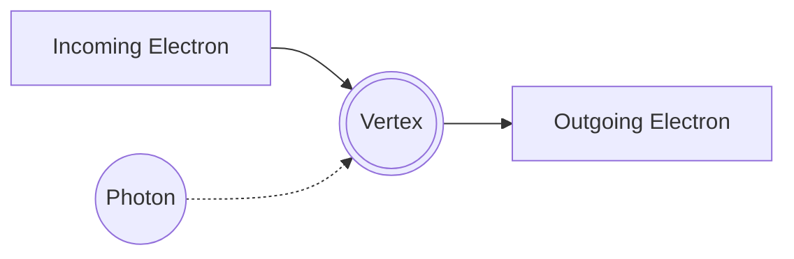

Host 1: Welcome back, everyone! Today, we are diving into Unit 4 of Advanced Quantum Mechanics, focusing on the Hamiltonian in a radiation field and the quantum theory of radiation. This is a crucial topic for understanding how matter interacts with light at the deepest level.

Host 2: That's right! When we look at an atomic system inside an electromagnetic radiation field, we can't just use a simple classical potential anymore. We write the total Hamiltonian of the system as:

$$H = H_a + H_r + H'$$

Here, $H_a$ is the unperturbed atomic Hamiltonian, $H_r$ represents the pure radiation field, and $H'$ is the interaction Hamiltonian between the atom and the field.

Host 1: Exactly. Let's break down these terms. The pure radiation field Hamiltonian $H_r$ is given by integrating the energy density over space:

$$H_r = \frac{1}{2} \int \left( \epsilon_0 E^2 + \mu_0 H^2 \right) d\tau$$

But the real magic happens in the interaction term, $H'$. For a non-relativistic electron of charge $q$ in a vector potential $A$, the momentum operator $p$ is replaced by $p + qA$. 

Host 2: Yes, and when we expand the kinetic energy term $\frac{1}{2m}(p + qA)^2$, we get a few pieces. In the Coulomb gauge, where $\nabla \cdot A = 0$, the operators $p$ and $A$ commute, meaning $A \cdot p = p \cdot A$. If we neglect the very small quadratic term proportional to $A^2$ as a tiny perturbation, our interaction Hamiltonian simplifies beautifully to:

$$H' = \frac{q}{m} A \cdot p$$

Host 1: Let's summarize these components in a quick table so it's easy to remember for our exams:

| Hamiltonian Component | Expression | Physical Significance |
| :--- | :--- | :--- |
| **Atomic ($H_a$)** | $\frac{p^2}{2m} + V(r)$ | Energy of the isolated atom |
| **Radiation ($H_r$)** | $\frac{1}{2} \int (\epsilon_0 E^2 + \mu_0 H^2) d\tau$ | Energy of the free electromagnetic waves |
| **Interaction ($H'$)** | $\frac{q}{m} A \cdot p$ | Coupling between the electron's momentum and the field |

Host 2: Now, when we want to transition to a fully quantum description, we have to quantize the radiation field itself. This is done by expressing the vector potential $A$ in terms of creation and annihilation operators, $a_\lambda^\dagger$ and $a_\lambda$. These operators create or destroy photons of a specific mode $\lambda$.

Host 1: This leads us directly to Feynman diagrams! Introduced by Richard Feynman in 1949, these diagrams are a visual, graphical way to represent complex scattering processes and write down transition amplitudes. 

Host 2: Let's look at how a basic electromagnetic vertex is structured in these diagrams. Here is a simple representation of an electron interacting with a photon:

Host 1: At this vertex, the incoming electron emits or absorbs a photon. To calculate the actual probability amplitude of this happening, we follow the Feynman Rules. For instance, each QED vertex contributes a factor of the coupling constant, and each internal line gets a propagator term.

Host 2: Let's talk about the scattering processes we can analyze using these rules. The two main types we need to know are Thomson Scattering and Compton Scattering. 

Host 1: Thomson scattering is the classical, low-energy limit where light scatters off a free charged particle without any change in its frequency, meaning $\omega' = \omega$. The differential cross-section is given by:

$$\frac{d\sigma}{d\Omega} = r_0^2 (\sin^2\phi + \cos^2\theta \cos^2\phi)$$

Where $r_0 = \frac{e^2}{4\pi m}$ is the classical electron radius. 

Host 2: But when the photon energy is high, we enter the quantum regime, which is Compton Scattering. Here, the wavelength of the scattered light increases because the photon transfers some of its kinetic energy to the recoiling electron. The change in wavelength is given by the famous Compton relation:

$$\lambda' - \lambda = \frac{h}{m_e c}(1 - \cos\theta)$$

Host 1: In terms of frequencies, we can write the ratio of the final frequency $\omega'$ to the initial frequency $\omega$ as:

$$\frac{\omega'}{\omega} = \left[ 1 + \left(\frac{2\omega}{m}\right) \sin^2\left(\frac{\theta}{2}\right) \right]^{-1}$$

Host 2: Dynamically, we calculate this cross-section using second-order perturbation theory with Feynman diagrams, resulting in the famous Klein-Nishina formula. It's fascinating how a simple shift in energy changes our entire mathematical approach from classical electrodynamics to quantum field theory!

Host 1: It really is. That's all the time we have for today's review of Unit 4. Keep practicing these derivations and drawing those Feynman diagrams. See you next time!

Host 2: Bye everyone, happy studying!

Host 1: Wait, hold on a second, don't close your textbooks just yet! Our producer is waving at us through the glass—we actually have a few more minutes of airtime left. We can't wrap up Unit 4 without talking about the low-energy limit of that Klein-Nishina formula!

Host 2: Oh, you are so right! How could we almost skip Thomson scattering? When the incoming photon's energy is much smaller than the rest mass of the electron—meaning $\omega \ll m$—the quantum Klein-Nishina formula simplifies beautifully.

Host 1: Exactly. In this low-energy limit, the quantum recoil of the electron becomes completely negligible. The formula collapses right back into the classical Thomson cross-section:

$$\sigma_T = \frac{8\pi}{3} r_e^2$$

Where $r_e$ is the classical electron radius. It’s the perfect physical bridge showing how quantum field theory naturally yields classical electrodynamics when quantum effects fade out!

Host 2: It really is a beautiful correspondence. And we should also look at the opposite extreme—the ultra-relativistic limit where $\omega \gg m$. In that high-energy regime, the cross-section behaves very differently, dropping off as roughly:

$$\sigma \approx \frac{3}{8} \sigma_T \frac{m}{\omega} \left[ \ln\left(\frac{2\omega}{m}\right) + \frac{1}{2} \right]$$

Host 1: Right! It falls off significantly as energy increases. This is why high-energy gamma rays are so incredibly penetrating. They literally just slip right through material because the probability of them undergoing Compton scattering is so small compared to lower-energy X-rays.

Host 2: That's a crucial concept for radiation shielding and astrophysics. So, if you get an exam question asking about the energy dependence of the cross-section, remember: Thomson scattering at low energies is constant, but it drops off logarithmically at ultra-high energies!

Host 1: Now *that* is a top-tier exam tip to end on. Okay, our producer is finally giving us the actual wrap-up signal. 

Host 2: Haha, yes, no more bonus rounds! Thank you for sticking around for those extra minutes, everyone. Happy studying, and we'll see you for Unit 5!

Host 1: Bye everyone!