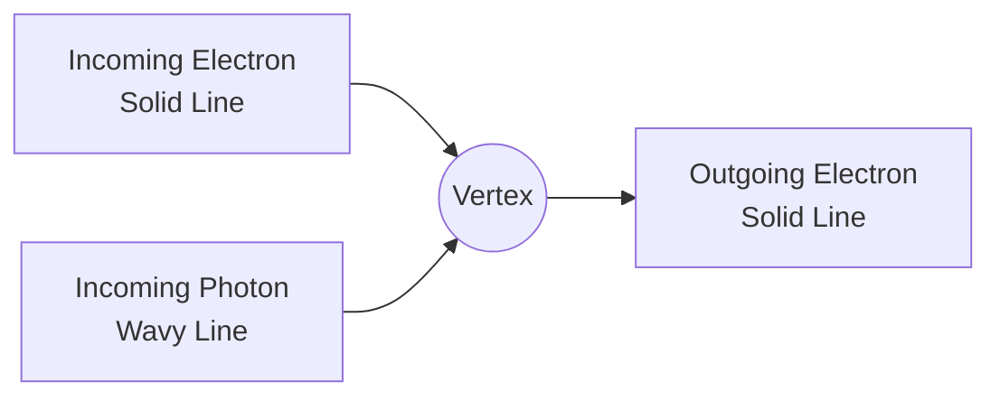

### CBSE Class 10 Standard Summary: Advanced Quantum Mechanics (Unit 4)

This unit explores how electromagnetic radiation (light) interacts with matter (atoms and electrons) at the quantum level, bridging wave and particle theories.

---

### 1. The Interaction Hamiltonian
To study an atom in a radiation field, we write the total energy of the system as a **Hamiltonian** ($H$), which consists of the atomic energy ($H_a$), the pure radiation energy ($H_r$), and the interaction energy ($H'$):

$$H = H_a + H_r + H'$$

In a Coulomb gauge ($\nabla \cdot \mathbf{A} = 0$), the interaction term simplifies to:
$$H' = \frac{q}{m} \mathbf{A} \cdot \mathbf{p}$$

---

### 2. Quantization of Radiation and Scattering
Light is quantized into packets of energy called photons. The total energy eigenvalues of the quantized radiation field are:

$$E = \sum \left(n_\lambda + \frac{1}{2}\right)\hbar\omega_\lambda$$

When light hits charged particles, it scatters. The two main types of scattering are:

| Scattering Type | Frequency Change | Formula / Cross-Section | Key Property |
| :--- | :--- | :--- | :--- |
| **Thomson Scattering** | No Change (Elastic) | $\sigma_{\text{Thom}} = \frac{8\pi}{3} r_0^2$ | Classical limit, low-energy. |
| **Compton Scattering** | Decreases (Inelastic) | $\lambda' - \lambda = \frac{h}{m_e c}(1 - \cos\theta)$ | Quantum limit, high-energy. |

---

### 3. Feynman Diagrams
Feynman diagrams are graphical tools used to visualize and calculate particle interactions:

* **Wavy Lines:** Represent photons.
* **Solid Lines:** Represent fermions (electrons/positrons).
* **Vertices:** Represent points of interaction where particles are created or annihilated.