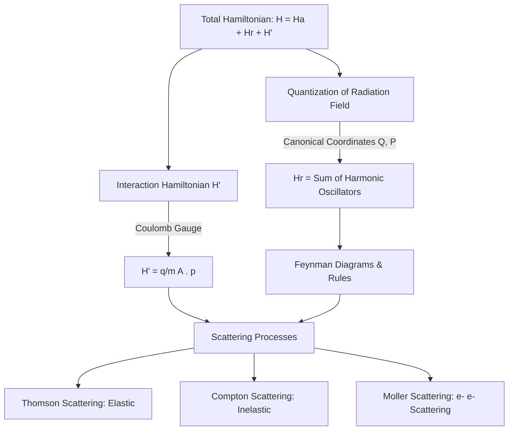

---

## Unit Overview & Flowchart

The following diagram maps the logical progression of Unit 4, starting from the classical system Hamiltonian to the quantized field and physical scattering processes:

---

## Scene-by-Scene Video Script

### Scene 1: Introduction to the Radiation Field Hamiltonian
* **Duration:** 30 seconds
* **Visual Prompt:** A cinematic, deep-space view of a hydrogen atom at the center. Neon-blue electromagnetic waves oscillate and wash over the atom. Glowing 3D mathematical equations slowly float in the foreground: $H = H_a + H_r + H'$. The camera slowly pans around the atom as it vibrates with energy.
* **Narration:** 
  "Welcome to Advanced Quantum Mechanics. Today, we dive into Unit 4: The Hamiltonian in the Radiation Field. To understand how atoms interact with light, we write the total Hamiltonian of the system as:
  
  $$H = H_a + H_r + H'$$
  
  Here, $H_a$ is the atomic Hamiltonian, $H_r$ is the pure radiation field, and $H'$ represents the dynamic interaction between them."

---

### Scene 2: Deriving the Interaction Hamiltonian ($H'$)
* **Duration:** 30 seconds
* **Visual Prompt:** A stylized, high-contrast scientific blackboard where equations are written in glowing white chalk. The term $\frac{1}{2m}(p + qA)^2 + V + H_r$ expands dynamically. Terms cancel out, highlighting the transition to $H' = \frac{q}{2m}(A \cdot p + p \cdot A)$. A glowing cursor highlights the Coulomb gauge condition $\nabla \cdot A = 0$.
* **Narration:** 
  "For a non-relativistic electron of charge $q$, we replace the classical momentum $p$ with the gauge-invariant operator $p + qA$. Under the Coulomb gauge, where:
  
  $$\nabla \cdot A = 0$$
  
  we prove that $A \cdot p = p \cdot A$. Neglecting the very small quadratic $A^2$ perturbation term, our interaction Hamiltonian simplifies beautifully to:
  
  $$H' = \frac{q}{m} A \cdot p$$"

---

### Scene 3: Quantization of the Radiation Field
* **Duration:** 30 seconds
* **Visual Prompt:** Transition from smooth, continuous waves to discrete, glowing golden wave packets (photons). An abstract representation of quantum harmonic oscillators, with energy rungs lighting up one by one as equations for creation and annihilation operators ($a_\lambda$ and $a_\lambda^\dagger$) float past.
* **Narration:** 
  "To quantize this electromagnetic field, we treat the vector potential $A$ as a collection of canonical coordinates $Q_\lambda$ and $P_\lambda$. Introducing the dimensionless creation and annihilation operators, we write the field Hamiltonian as:
  
  $$H_r = \sum_{\lambda} \left( n_\lambda + \frac{1}{2} \right) \hbar \omega_\lambda$$
  
  The radiation field is now mathematically equivalent to an infinite set of independent quantum harmonic oscillators."

---

### Scene 4: Thomson and Compton Scattering
* **Duration:** 30 seconds
* **Visual Prompt:** A split-screen 3D animation. On the left: Elastic Thomson scattering, showing a photon hitting a free electron and bouncing off with the exact same wavelength. On the right: Compton scattering, showing a photon colliding with an electron, transferring energy, and recoiling with a longer wavelength.
* **Narration:** 
  "We apply this to two fundamental processes. In Thomson scattering, light scatters elastically with no change in frequency. Its classical cross-section depends on the classical electron radius $r_0$:
  
  $$\sigma_{\text{Thom}} = \frac{8\pi}{3} r_0^2$$
  
  In Compton scattering, the collision is inelastic, causing a shift in photon wavelength, which we compute using quantum electrodynamics."

---

### Scene 5: Feynman Diagrams & Rules
* **Duration:** 30 seconds
* **Visual Prompt:** A sleek, dark digital canvas. White glowing lines draw a Feynman diagram: a straight incoming fermion line meets a wavy photon line at a vertex, then continues outward. A glowing circle highlights the vertex, and the label $ie\gamma^\mu$ appears next to it. 
* **Narration:** 
  "To simplify these complex quantum transitions, we use Feynman diagrams. Fermions, like electrons, are represented by solid lines, while photons are represented by wavy lines. Every point of interaction is a vertex. By following specific Feynman rules, we can translate these visual diagrams directly into precise mathematical transition matrices."

---

### Scene 6: Key Summary of Unit 4
* **Duration:** 30 seconds
* **Visual Prompt:** A clean, modern summary slide showing a table containing the core components of the unit. The camera gently zooms in on the formulas.
* **Narration:** 
  "Let's review the key formulas you need for your examinations. Keep these relationships and derivations in mind as you prepare. Mastering these foundations is your gateway to quantum electrodynamics. See you in the next unit!"

---

## Summary of Key Concepts

| Concept | Mathematical Expression | Physical Significance |
| :--- | :--- | :--- |
| **Total Hamiltonian** | $$H = H_a + H_r + H'$$ | Describes the combined system of atom, radiation, and their coupling. |
| **Interaction Hamiltonian** | $$H' = \frac{q}{m} A \cdot p$$ | Governs the transitions between energy states due to radiation. |
| **Quantized Field Energy** | $$H_r = \sum \left(n_\lambda + \frac{1}{2}\right) \hbar \omega_\lambda$$ | Establishes the photon picture of electromagnetic radiation. |
| **Thomson Cross-Section** | $$\sigma_{\text{Thom}} = \frac{8\pi}{3} r_0^2$$ | Defines classical elastic scattering of light by a charged particle. |
| **Classical Electron Radius**| $$r_0 = \frac{e^2}{4\pi m c^2}$$ | Fundamental length scale of an electron in electrodynamics. |