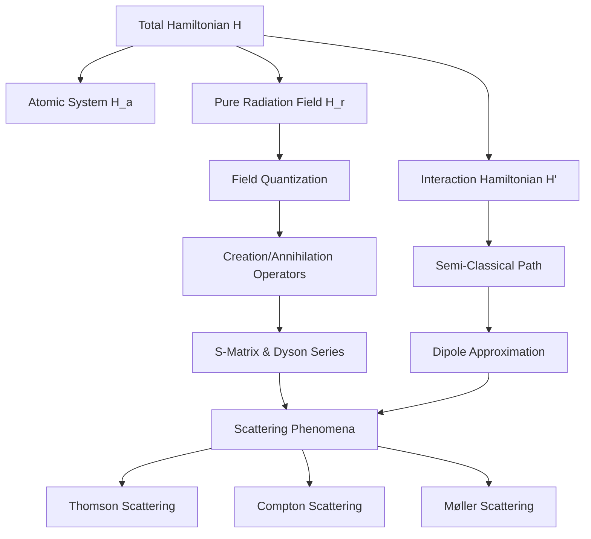
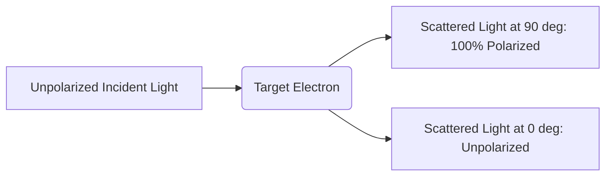

## Unit IV: Advanced Quantum Mechanics & Light-Matter Interactions (Field Quantization, Scattering, & QED)

---

## 1. Chapter Overview

This unit bridges the gap between classical electromagnetism and Quantum Electrodynamics (QED). It explores how a quantum-mechanical atomic system interacts with an electromagnetic radiation field. By moving from a semi-classical treatment (where the atom is quantized but the field is classical) to a fully quantized field theory, we uncover the fundamental mechanisms of photon emission, absorption, and quantum scattering.

---

## 2. Key Concepts

### Concept 1: The Coupled Light-Matter Hamiltonian
To describe an electron of charge $q$ and mass $m$ bound to an atomic potential $V(\mathbf{r})$ in the presence of an electromagnetic radiation field, we use the principle of **minimal coupling**. The canonical momentum $\mathbf{p}$ of the electron is replaced by its kinetic momentum:
$$\mathbf{p} \to \mathbf{p} + q\mathbf{A}$$

where $\mathbf{A}(\mathbf{r}, t)$ is the vector potential of the radiation field.

The total Hamiltonian of the coupled system is:
$$H = \frac{1}{2m}(\mathbf{p} + q\mathbf{A})^2 + V(\mathbf{r}) + H_r$$

Expanding this term:
$$H = \frac{1}{2m} \left( \mathbf{p}^2 + q(\mathbf{p}\cdot\mathbf{A} + \mathbf{A}\cdot\mathbf{p}) + q^2 A^2 \right) + V(\mathbf{r}) + H_r$$

We define the unperturbed atomic Hamiltonian $H_a$ as:
$$H_a = \frac{\mathbf{p}^2}{2m} + V(\mathbf{r})$$

This allows us to write the total Hamiltonian as:
$$H = H_a + H_r + H'$$

where the interaction Hamiltonian $H'$ is:
$$H' = \frac{q}{2m}(\mathbf{A}\cdot\mathbf{p} + \mathbf{p}\cdot\mathbf{A}) + \frac{q^2}{2m}A^2$$

#### The Coulomb Gauge Simplification
In quantum mechanics, $\mathbf{p} = -i\hbar\nabla$. Thus, the operator product $\mathbf{p}\cdot\mathbf{A}$ acting on a test wavefunction $\psi$ is:
$$\mathbf{p}\cdot(\mathbf{A}\psi) = -i\hbar \nabla \cdot (\mathbf{A}\psi) = -i\hbar [(\nabla\cdot\mathbf{A})\psi + \mathbf{A}\cdot(\nabla\psi)]$$

By choosing the **Coulomb gauge** (also called the transverse radiation gauge), we set:
$$\nabla \cdot \mathbf{A} = 0$$

Under this gauge condition:
$$\mathbf{p}\cdot\mathbf{A} = \mathbf{A}\cdot\mathbf{p}$$

Consequently, the interaction Hamiltonian simplifies to:
$$H' = \frac{q}{m}\mathbf{A}\cdot\mathbf{p} + \frac{q^2}{2m}A^2$$

For weak radiation fields (such as standard optical transitions), the quadratic term $\frac{q^2}{2m}A^2$ is extremely small compared to the linear term and can be neglected as a perturbation:
$$H' \approx \frac{q}{m}\mathbf{A}\cdot\mathbf{p}$$

---

### Concept 2: The Dipole Approximation
When calculating the transition probability of an electron between two atomic states $|n\rangle$ and $|s\rangle$, we evaluate the matrix element of the vector potential $\mathbf{A} = \hat{e} A_0 \cos(\mathbf{k}\cdot\mathbf{r} - \omega t)$, which contains spatial phase factors of the form $e^{\pm i \mathbf{k}\cdot\mathbf{r}}$.

#### Mathematical Justification
*   **Atomic Dimensions ($r$):** Typically on the order of the Bohr radius, $a_0 \approx 10^{-10}\text{ m}$.
*   **Optical Wavelength ($\lambda$):** Typically $\approx 5000\text{ \AA} = 5 \times 10^{-7}\text{ m}$.
*   **Wave number ($k$):** $k = \frac{2\pi}{\lambda} \approx 10^7\text{ m}^{-1}$.

Evaluating the exponent:
$$\mathbf{k}\cdot\mathbf{r} \approx k r \approx (10^7\text{ m}^{-1})(10^{-10}\text{ m}) = 10^{-3} \ll 1$$

Using a Taylor expansion for the spatial factor:
$$e^{\pm i \mathbf{k}\cdot\mathbf{r}} = 1 \pm i\mathbf{k}\cdot\mathbf{r} - \frac{1}{2}(\mathbf{k}\cdot\mathbf{r})^2 + \dots \approx 1$$

Setting $e^{\pm i \mathbf{k}\cdot\mathbf{r}} \approx 1$ is called the **electric dipole (E1) approximation**. It assumes the electromagnetic wave's phase is spatially uniform across the entire volume of the atom.

#### Momentum-Position Matrix Element Translation
To compute transition rates, we need to evaluate $\langle s | \mathbf{p} | n \rangle$. We can express this momentum matrix element in terms of the position operator $\mathbf{r}$ using the fundamental commutator relations.

Let's derive $[x, H_a]$:
$$[x, H_a] = \left[x, \frac{p_x^2 + p_y^2 + p_z^2}{2m} + V(r)\right] = \left[x, \frac{p_x^2}{2m}\right]$$

Using the identity $[A, B^2] = [A, B]B + B[A, B]$ and the canonical commutator $[x, p_x] = i\hbar$:
$$[x, p_x^2] = [x, p_x]p_x + p_x[x, p_x] = 2i\hbar p_x$$

Thus:
$$[x, H_a] = \frac{i\hbar}{m}p_x \implies p_x = \frac{m}{i\hbar}[x, H_a]$$

Generalizing this to three dimensions:
$$\mathbf{p} = \frac{m}{i\hbar}[\mathbf{r}, H_a]$$

Now, we calculate the matrix element between the eigenstates $|n\rangle$ and $|s\rangle$ of $H_a$ (where $H_a|n\rangle = E_n|n\rangle$):
$$\langle s | \mathbf{p} | n \rangle = \frac{m}{i\hbar} \langle s | (\mathbf{r}H_a - H_a\mathbf{r}) | n \rangle = \frac{m}{i\hbar}(E_n - E_s) \langle s | \mathbf{r} | n \rangle$$

Letting $E_n - E_s = \hbar \omega_{ns}$:
$$\langle s | \mathbf{p} | n \rangle = \frac{m}{i\hbar}(\hbar \omega_{ns}) \langle s | \mathbf{r} | n \rangle = i m \omega_{ns} \langle s | \mathbf{r} | n \rangle$$

This relation allows transition rates calculated via $\mathbf{A}\cdot\mathbf{p}$ to be directly converted into electric dipole transition moments proportional to the position matrix elements $\langle s | \mathbf{r} | n \rangle$.

---

### Concept 3: Quantization of the Electromagnetic Radiation Field
In classical electrodynamics, the total energy of a radiation field confined in a volume $V$ is:
$$H_r = \frac{1}{2} \int_V \left( \epsilon_0 \mathbf{E}^2 + \mu_0 \mathbf{H}^2 \right) d\tau$$

To quantize this field, we decompose the vector potential $\mathbf{A}(\mathbf{r}, t)$ into normal modes of the cavity:
$$\mathbf{A}(\mathbf{r}, t) = \sum_\lambda \left[ q_\lambda(t) \mathbf{A}_\lambda(\mathbf{r}) + q_\lambda^*(t) \mathbf{A}_\lambda^*(\mathbf{r}) \right]$$

By defining real canonical coordinates $Q_\lambda(t)$ and conjugate momenta $P_\lambda(t)$:
$$Q_\lambda(t) = \sqrt{\epsilon_0 V}(q_\lambda + q_\lambda^*)$$
$$P_\lambda(t) = -i\omega_\lambda \sqrt{\epsilon_0 V}(q_\lambda - q_\lambda^*)$$

The field Hamiltonian takes the form of a collection of uncoupled harmonic oscillators:
$$H_r = \frac{1}{2}\sum_\lambda \left( P_\lambda^2 + \omega_\lambda^2 Q_\lambda^2 \right)$$

We then impose the canonical commutation relation $[Q_\lambda, P_\mu] = i\hbar \delta_{\lambda\mu}$ and define the dimensionless creation ($a_\lambda^\dagger$) and annihilation ($a_\lambda$) operators:
$$a_\lambda = \frac{1}{\sqrt{2\hbar\omega_\lambda}}(\omega_\lambda Q_\lambda + i P_\lambda)$$
$$a_\lambda^\dagger = \frac{1}{\sqrt{2\hbar\omega_\lambda}}(\omega_\lambda Q_\lambda - i P_\lambda)$$

These operators satisfy:
$$[a_\lambda, a_\mu^\dagger] = \delta_{\lambda\mu}$$

Substituting these back into the Hamiltonian yields the quantized field operator:
$$H_r = \sum_\lambda \hbar \omega_\lambda \left( a_\lambda^\dagger a_\lambda + \frac{1}{2} \right)$$

The eigenvalues of the number operator $N_\lambda = a_\lambda^\dagger a_\lambda$ are non-negative integers $n_\lambda = 0, 1, 2, \dots$, representing the number of photons in mode $\lambda$. Even in the absence of real photons ($n_\lambda = 0$), each mode retains a zero-point energy of $\frac{1}{2}\hbar\omega_\lambda$.

---

### Concept 4: S-Matrix, Dyson Expansion, and Feynman Diagrams
In time-dependent perturbation theory, the S-matrix (scattering matrix) maps the initial asymptotic free state $|\Psi_i\rangle = |\Psi(t \to -\infty)\rangle$ to the final state $|\Psi_f\rangle = |\Psi(t \to +\infty)\rangle$:
$$S = U(+\infty, -\infty)$$

The time-evolution operator $U(t, t_0)$ in the interaction picture satisfies:
$$i\hbar \frac{\partial}{\partial t} U(t, t_0) = H_I(t) U(t, t_0)$$

Integrating this equation iteratively yields the **Dyson Series**:
$$U(t, t_0) = 1 + \sum_{n=1}^\infty \left( \frac{-i}{\hbar} \right)^n \int_{t_0}^t dt_1 \int_{t_0}^{t_1} dt_2 \dots \int_{t_0}^{t_{n-1}} dt_n H_I(t_1) H_I(t_2) \dots H_I(t_n)$$

To integrate over a symmetric domain, we introduce the **Dyson Chronological Time-Ordering Operator ($P$ or $T$)**:
$$P\{H_I(t_1)H_I(t_2)\} = \begin{cases} 
H_I(t_1)H_I(t_2) & \text{if } t_1 > t_2 \\ 
H_I(t_2)H_I(t_1) & \text{if } t_2 > t_1 
\end{cases}$$

This simplifies the S-matrix to:
$$S = \sum_{n=0}^\infty \frac{(-i)^n}{n! \hbar^n} \int_{-\infty}^{\infty} dt_1 \dots \int_{-\infty}^{\infty} dt_n P[H_I(t_1)\dots H_I(t_n)]$$

Feynman diagrams are graphical representations of individual terms in this expansion.

---

## 3. Definitions and Terminology

| Term | Definition | Mathematical Formulation / Value |
| :--- | :--- | :--- |
| **Coulomb Gauge** | A gauge choice where the vector potential has no divergence, making electromagnetic waves purely transverse. | $\nabla \cdot \mathbf{A} = 0$ |
| **Electric Dipole Approximation** | The simplification that the spatial variation of an EM wave is negligible across atomic dimensions. | $e^{i\mathbf{k}\cdot\mathbf{r}} \approx 1$ |
| **Classical Electron Radius ($r_0$)** | The characteristic electrostatic size of a classical electron. | $r_0 = \frac{e^2}{4\pi\epsilon_0 m c^2} \approx 2.82 \times 10^{-15}\text{ m}$ |
| **Thomson Scattering** | The elastic scattering of electromagnetic radiation by a free charged particle in the low-energy limit. | $\sigma_{\text{unpol}}(\theta) = \frac{r_0^2}{2}(1 + \cos^2\theta)$ |
| **Compton Scattering** | The inelastic scattering of a photon by a charged particle, resulting in a wavelength shift. | $\lambda' - \lambda = \frac{h}{mc}(1 - \cos\theta)$ |
| **S-Matrix (Scattering Matrix)** | An operator that maps the initial free-particle states in the remote past to the final states in the remote future. | $S = U(+\infty, -\infty)$ |
| **Chronological Product ($P$)** | An operator that sorts a product of time-dependent operators so that their time arguments increase from right to left. | $P[A(t_1)B(t_2)] = A(t_1)B(t_2) \, \Theta(t_1-t_2) + B(t_2)A(t_1) \, \Theta(t_2-t_1)$ |
| **Møller Scattering** | The relativistic scattering process of two electrons (identical charged fermions). | $e^- + e^- \to e^- + e^-$ |
| **Lorentz Condition** | A covariant gauge condition that maintains explicit Lorentz invariance of the four-potential. | $\partial_\mu A^\mu = 0$ |

---

## 4. Important Points & Deep Physics Insights

### Insight 1: Why the $A^2$ Term is Neglected in Weak Fields
In the interaction Hamiltonian $H' = \frac{q}{m}\mathbf{A}\cdot\mathbf{p} + \frac{q^2}{2m}A^2$, the relative strength of the two terms is determined by the ratio of their amplitudes.
Let's analyze the ratio of the second term to the first:
$$\frac{\frac{q^2 A^2}{2m}}{\frac{q A p}{m}} \approx \frac{q A}{2p}$$

Since the momentum of a bound electron is roughly $p \approx \hbar/a_0$, and the vector potential amplitude $A$ is related to the electric field strength $E_0$ by $A = E_0/\omega$:
$$\frac{q A}{2p} \approx \frac{q E_0 a_0}{2 \hbar \omega}$$

For weak field sources (like a standard light bulb or sunlight), the electric field potential energy across an atom ($q E_0 a_0$) is much smaller than the photon energy ($\hbar \omega$). As a result, the quadratic $A^2$ term is treated as a negligible higher-order correction.

However, this term cannot be ignored in ultra-intense laser fields, where $q E_0 a_0 \ge \hbar \omega$. In these regimes, the $A^2$ term drives multiphoton processes and pondermotive forces.

---

### Insight 2: Crossing Symmetry in Quantum Field Theory
**Crossing symmetry** is a powerful principle in quantum field theory. It states that the transition amplitude for a process involving an incoming particle with momentum $k$ is mathematically identical to a process involving an outgoing antiparticle with momentum $-k$.

For example, **Compton Scattering**:
$$e^- + \gamma \to e^- + \gamma$$

is related via crossing symmetry to **Electron-Positron Annihilation**:
$$e^- + e^+ \to \gamma + \gamma$$

By substituting $k \leftrightarrow -k'$ and $p \leftrightarrow -p'$ in the invariant amplitude, we can obtain the cross-section for one process directly from the other. This significantly simplifies calculations.

---

### Insight 3: Unpolarized Thomson Scattering Angular Dependence
When unpolarized light undergoes Thomson scattering, the scattered light becomes partially polarized.

This angular dependence is described by the factor $(1 + \cos^2\theta)$:
1.  **Forward/Backward Scattering ($\theta = 0^\circ, 180^\circ$):** The scattering cross-section is at a maximum ($\propto 2$). The electron oscillates symmetrically in both transverse directions, and the scattered light remains unpolarized.
2.  **Right-Angle Scattering ($\theta = 90^\circ$):** The scattering cross-section drops by half ($\propto 1$). At this angle, observers only see the projection of the electron's motion perpendicular to the scattering plane, meaning the scattered light is $100\%$ linearly polarized.

---

## 5. Common Mistakes

*   **Assuming $\mathbf{p}\cdot\mathbf{A} = \mathbf{A}\cdot\mathbf{p}$ holds in all gauges:**
    This relation is only valid in the **Coulomb gauge** ($\nabla \cdot \mathbf{A} = 0$). In any other gauge, they do not commute:
    $$[\mathbf{p}, \mathbf{A}] = -i\hbar(\nabla\cdot\mathbf{A}) \ne 0$$
    Always verify your gauge condition before simplifying the Hamiltonian.

*   **Confusing Classical and Quantum Scattering Regimes:**
    Students often apply the classical Thomson formula to high-energy gamma rays. Thomson scattering assumes **no change** in the photon's wavelength ($\lambda = \lambda'$). If the incident photon energy is comparable to the electron's rest mass energy ($h\nu \ge m_e c^2$), you must use the quantum-mechanical **Klein-Nishina formula** to account for relativistic momentum transfer (Compton shift).

*   **Incorrectly Normalizing Photon States:**
    When transitioning from a classical vector potential to a quantum operator, students sometimes forget that a photon mode has a finite quantization volume $V$. The field operator must contain the normalization factor $\sqrt{\frac{\hbar}{2\epsilon_0 \omega V}}$ to preserve the commutation relations $[a, a^\dagger] = 1$ and ensure the energy of a single photon state $|1\rangle$ is exactly $\hbar\omega$.

---

## 6. Prep Tips & Advanced Problem-Solving Strategies

1.  **Master Commutator Algebra:**
    Olympiad and advanced exam questions frequently test your ability to evaluate commutator brackets. Memorize and practice applying the identity:
    $$[A, BC] = [A, B]C + B[A, C]$$
    This is especially useful when simplifying interactions with the kinetic energy operator $\mathbf{p}^2/2m$.

2.  **Understand the Classical Electron Radius ($r_0$):**
    When calculating scattering cross-sections, do not re-calculate the constant $\frac{e^2}{4\pi\epsilon_0 m_e c^2}$ from scratch. Remember its value:
    $$r_0 \approx 2.82 \text{ fm} = 2.82 \times 10^{-15} \text{ m}$$
    And keep in mind that its square is:
    $$r_0^2 \approx 7.95 \times 10^{-30} \text{ m}^2 = 0.0795 \text{ barns}$$
    This will save you valuable time during calculations.

3.  **Recognize the Core Feynman Rules (QED):**
    For exams that test your qualitative understanding of QED, remember these basic rules:

| Diagram Component | Physical Meaning | Mathematical Factor / Operator |
| :--- | :--- | :--- |
| **Wavy Line** | Photon (propagator or external) | Vector potential $A_\mu$ / propagator $D_{\mu\nu}$ |
| **Solid Line with Arrow** | Fermion (electron/positron) | Spinor wavefunction $\psi$ / propagator $S_F$ |
| **Vertex (Junction)** | Interaction point | Charge coupling factor: $-ie\gamma^\mu$ |

---

## 7. Quick Revision Points

*   **The Coupled Hamiltonian:**
    $$H = H_a + H_r + H'$$
    In the Coulomb gauge ($\nabla \cdot \mathbf{A} = 0$), the interaction Hamiltonian is:
    $$H' = \frac{q}{m}\mathbf{A}\cdot\mathbf{p} + \frac{q^2}{2m}A^2$$

*   **Dipole Approximation Condition:**
    $$kr \ll 1 \implies e^{\pm i \mathbf{k}\cdot\mathbf{r}} \approx 1$$
    This approximation assumes the wave's phase is uniform across the atom.

*   **The Momentum-Position Commutator Identity:**
    $$\mathbf{p} = \frac{m}{i\hbar}[\mathbf{r}, H_a]$$
    This allows us to write momentum matrix elements in terms of dipole moments:
    $$\langle s | \mathbf{p} | n \rangle = i m \omega_{ns} \langle s | \mathbf{r} | n \rangle$$

*   **Quantized Field Energy:**
    $$H_r = \sum_\lambda \hbar\omega_\lambda \left( a_\lambda^\dagger a_\lambda + \frac{1}{2} \right)$$
    This describes a collection of quantum harmonic oscillators, each with a zero-point energy of $\frac{1}{2}\hbar\omega_\lambda$.

*   **The S-Matrix (Dyson Series):**
    $$S = P \exp \left( -\frac{i}{\hbar} \int_{-\infty}^{\infty} H_I(t) dt \right)$$
    The chronological operator $P$ ensures proper time-ordering of the interactions.

*   **Thomson Scattering Cross-Sections:**
    *   *Differential:*
        $$\sigma(\theta) = \frac{r_0^2}{2}(1 + \cos^2\theta)$$
    *   *Total:*
        $$\sigma_T = \frac{8\pi}{3} r_0^2 \approx 6.65 \times 10^{-25} \text{ cm}^2 = 0.665 \text{ barns}$$

*   **Compton Shift Formula:**
    $$\Delta \lambda = \lambda' - \lambda = \lambda_c (1 - \cos\theta)$$
    where $\lambda_c = \frac{h}{m_e c} \approx 2.426 \times 10^{-12}\text{ m}$ is the Compton wavelength of the electron.

*   **Classical Electron Radius:**
    $$r_0 = \frac{e^2}{4\pi\epsilon_0 m_e c^2} \approx 2.82 \times 10^{-15} \text{ m}$$