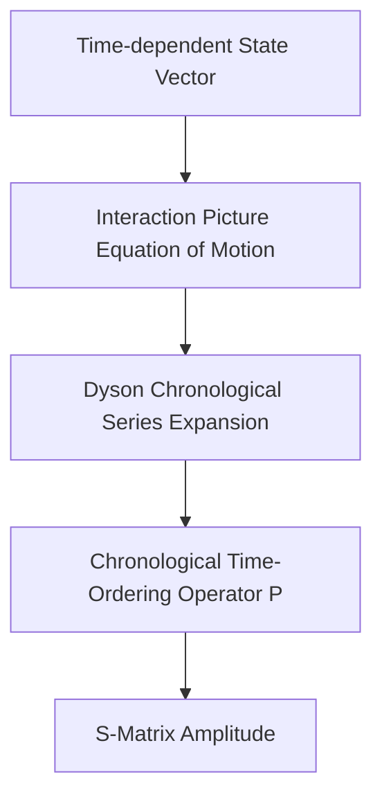

Question 1
What is the correct relation between the momentum and position matrix elements for the eigenstates of the atomic Hamiltonian?
A. $\langle s | \vec{p} | n \rangle = -i m \omega_{ns} \langle s | \vec{r} | n \rangle$
B. $\langle s | \vec{p} | n \rangle = \frac{m \omega_{ns}}{\hbar} \langle s | \vec{r} | n \rangle$
C. $\langle s | \vec{p} | n \rangle = i m \omega_{ns} \langle s | \vec{r} | n \rangle$
D. $\langle s | \vec{p} | n \rangle = -\frac{i \omega_{ns}}{m} \langle s | \vec{r} | n \rangle$

Correct Answer: A
Explanation: 
To find the relation between the momentum and position matrix elements, we use the commutator of the position operator $\vec{r}$ with the atomic Hamiltonian $H_a$:
$$H_a = \frac{\vec{p}^2}{2m} + V(\vec{r})$$

Since the potential $V(\vec{r})$ commutes with the position operator, we evaluate the commutator $[x, H_a]$ for the $x$-component:
$$[x, H_a] = \left[ x, \frac{p_x^2 + p_y^2 + p_z^2}{2m} \right] = \frac{1}{2m} [x, p_x^2] = \frac{1}{2m} (p_x [x, p_x] + [x, p_x] p_x)$$

Using the canonical commutation relation $[x, p_x] = i\hbar$:
$$[x, H_a] = \frac{i\hbar}{m} p_x \implies p_x = \frac{m}{i\hbar} [x, H_a]$$

Now, we take the matrix elements of both sides between the eigenstates $|n\rangle$ and $|s\rangle$ of the Hamiltonian $H_a$ (where $H_a|n\rangle = E_n|n\rangle$ and $H_a|s\rangle = E_s|s\rangle$):
$$\langle s | p_x | n \rangle = \frac{m}{i\hbar} \langle s | (x H_a - H_a x) | n \rangle = \frac{m}{i\hbar} (E_n - E_s) \langle s | x | n \rangle$$

Defining the transition frequency as $\hbar \omega_{ns} = E_n - E_s$, we obtain:
$$\langle s | p_x | n \rangle = \frac{m \cdot \hbar \omega_{ns}}{i\hbar} \langle s | x | n \rangle = -i m \omega_{ns} \langle s | x | n \rangle$$

Extending this to three dimensions:
$$\langle s | \vec{p} | n \rangle = -i m \omega_{ns} \langle s | \vec{r} | n \rangle$$

---

Question 2
Under what gauge condition and approximation does the interaction Hamiltonian of a non-relativistic electron in an electromagnetic field simplify to $H' = \frac{q}{m}\vec{A}\cdot\vec{p}$?
A. Lorentz gauge ($\partial_\mu A^\mu = 0$) and neglecting weak fields ($\vec{A}^2 \approx 0$)
B. Coulomb gauge ($\nabla \cdot \vec{A} = 0$) and neglecting weak fields ($\vec{A}^2 \approx 0$)
C. Coulomb gauge ($\nabla \cdot \vec{A} = 0$) and assuming a strong field limit ($\vec{A}^2 \gg \vec{A}\cdot\vec{p}$)
D. Weyl gauge ($A_0 = 0$) and neglecting quantum fluctuations

Correct Answer: B
Explanation: 
The interaction Hamiltonian of a non-relativistic electron in an electromagnetic field is given by:
$$H = \frac{1}{2m}(\vec{p} + q\vec{A})^2 + V + H_r = \frac{1}{2m}(\vec{p}^2 + q\vec{p}\cdot\vec{A} + q\vec{A}\cdot\vec{p} + q^2\vec{A}^2) + V + H_r$$

Subtracting the unperturbed atomic Hamiltonian $H_a = \frac{\vec{p}^2}{2m} + V$ and the pure radiation field Hamiltonian $H_r$, we isolate the interaction term:
$$H' = \frac{q}{2m} (\vec{p}\cdot\vec{A} + \vec{A}\cdot\vec{p}) + \frac{q^2}{2m}\vec{A}^2$$

The term $\vec{p}\cdot\vec{A}$ acts as an operator on a wave function $\psi$:
$$\vec{p}\cdot(\vec{A}\psi) = -i\hbar \nabla \cdot (\vec{A}\psi) = -i\hbar (\nabla \cdot \vec{A})\psi - i\hbar \vec{A}\cdot(\nabla\psi) = -i\hbar(\nabla\cdot\vec{A})\psi + \vec{A}\cdot\vec{p}\psi$$

This implies:
$$[\vec{p}, \vec{A}] = -i\hbar(\nabla\cdot\vec{A})$$

In the **Coulomb gauge**, the divergence of the vector potential is zero ($\nabla\cdot\vec{A} = 0$). Under this condition, the operators commute ($[\vec{p}, \vec{A}] = 0$), so $\vec{p}\cdot\vec{A} = \vec{A}\cdot\vec{p}$. 

Thus:
$$H' = \frac{q}{m}\vec{A}\cdot\vec{p} + \frac{q^2}{2m}\vec{A}^2$$

If the radiation field is weak, the term quadratic in the vector potential ($\frac{q^2}{2m}\vec{A}^2$) acts as an extremely small perturbation and can be safely neglected, simplifying the expression to $H' = \frac{q}{m}\vec{A}\cdot\vec{p}$.

---

Question 3
What is the total Thomson scattering cross-section $\sigma_T$ for unpolarized electromagnetic waves scattering off a free electron?
A. $\sigma_T = \frac{4\pi}{3} r_0^2$
B. $\sigma_T = \frac{8\pi}{3} r_0^2$
C. $\sigma_T = \frac{2\pi}{3} r_0^2$
D. $\sigma_T = 2\pi r_0^2$

Correct Answer: B
Explanation: 
For unpolarized electromagnetic waves scattering off a free electron, the differential cross-section is obtained by averaging the polarization-dependent cross-section over the azimuthal angle $\phi$:
$$\frac{d\sigma}{d\Omega} = \frac{r_0^2}{2}(1 + \cos^2\theta)$$

To find the total Thomson scattering cross-section $\sigma_T$, we integrate this expression over all solid angles $d\Omega = \sin\theta \, d\theta \, d\phi$:
$$\sigma_T = \int \frac{d\sigma}{d\Omega} d\Omega = \frac{r_0^2}{2} \int_{0}^{2\pi} d\phi \int_{0}^{\pi} (1 + \cos^2\theta)\sin\theta \, d\theta$$

Evaluating the integrals:
$$\int_{0}^{2\pi} d\phi = 2\pi$$
$$\int_{0}^{\pi} (1 + \cos^2\theta)\sin\theta \, d\theta = \left[ -\cos\theta - \frac{\cos^3\theta}{3} \right]_{0}^{\pi} = \left(1 + \frac{1}{3}\right) - \left(-1 - \frac{1}{3}\right) = \frac{4}{3} + \frac{4}{3} = \frac{8}{3}$$

Multiplying the components together:
$$\sigma_T = \frac{r_0^2}{2} \times 2\pi \times \frac{8}{3} = \frac{8\pi}{3}r_0^2$$

### Comparison of Scattering Regimes
| Scattering Type | Target Particle | Energy Regime | Cross-Section Formula | Key Physical Feature |
| :--- | :--- | :--- | :--- | :--- |
| **Thomson** | Free Electron | Classical / Low Energy ($h\nu \ll mc^2$) | $\sigma_T = \frac{8\pi}{3} r_0^2$ | No frequency shift ($\omega' = \omega$) |
| **Compton** | Free Electron | Relativistic / High Energy ($h\nu \sim mc^2$) | Klein-Nishina Formula | Shift in wavelength ($\Delta \lambda = \frac{h}{mc}(1-\cos\theta)$) |
| **Moller** | Identical Electrons | Relativistic | $\frac{d\sigma}{d\Omega}$ (Mandelstam $s, t, u$ dependent) | Symmetric under exchange of final states ($t \leftrightarrow u$) |

---

Question 4
In spinless Moller scattering, why must the covariant transition amplitude be symmetric under the exchange of the Mandelstam variables $t$ and $u$?
A. Fermi-Dirac statistics for spin-$1/2$ fermions, which demands an anti-symmetric total wave function.
B. Bose-Einstein statistics for spinless bosons, which demands a symmetric total wave function.
C. Gauge invariance of the electromagnetic field, which requires physical observables to be independent of the potential's phase.
D. Conservation of leptonic charge, which prevents the mixing of lepton generations.

Correct Answer: B
Explanation: 
In spinless Moller scattering, we consider the collision of two identical, charged, spinless bosons. The S-matrix elements can be calculated using the Dyson-chronological perturbation expansion:

Because the scattered particles are identical bosons, the final-state quantum wave function must be symmetric under the exchange of these two particles. In terms of Mandelstam variables:
* $t = (p' - p)^2$ represents the direct scattering channel.
* $u = (q' - p)^2$ represents the exchange scattering channel.

Exchanging the identity of the two final-state bosons corresponds to the transformation $t \leftrightarrow u$. Due to Bose-Einstein statistics, the covariant transition amplitude $T_{fi}^{\text{cov}}$ must be invariant under this exchange:
$$T_{fi}^{\text{cov}}(s, t, u) = T_{fi}^{\text{cov}}(s, u, t)$$

This directly manifests as the symmetric sum of the $t$-pole and $u$-pole in the amplitude equation:
$$T_{fi}^{\text{cov}} = e^2 \left[ \frac{\text{r.u}}{t} + \frac{\text{s.t}}{u} \right]$$

---

Question 5
What are the properties of particles described by a strictly Hermitian scalar field in the Klein-Gordon Lagrangian?
A. The field describes charged particles, and the total field charge $Q$ is conserved and non-zero.
B. The field describes particles that are their own antiparticles (neutral), and the current and charge densities vanish identically ($Q = 0$).
C. The field describes both positive and negative mesons, where the conserved charge $Q$ fluctuates dynamically.
D. The field represents photons with spin 1, rendering the scalar description invalid.

Correct Answer: B
Explanation: 
The Klein-Gordon (K.G.) Lagrangian density for a scalar field is invariant under a global $U(1)$ phase transformation $\Phi \to \Phi e^{i\alpha}$ only if the field $\Phi$ is complex. This phase invariance leads to the conservation of a $U(1)$ charge $Q$ via Noether's theorem:
$$Q = q \sum_{k} [n_+(k) - n_-(k)]$$

However, if we impose the Hermiticity condition on the scalar field such that $\Phi^\dagger = \Phi$, the field is strictly real. Under this condition:
1. The global phase transformation $\Phi \to \Phi e^{i\alpha}$ is no longer a valid symmetry because it makes the field complex.
2. The field operators simplify because the creation and annihilation operators for the particle and antiparticle become identical ($a(k) = b(k)$).
3. The current density $J^\mu$ and the charge density $J^0$ vanish identically.

Thus, a strictly Hermitian scalar field can only represent neutral spinless particles (such as the $\pi^0$ meson) that act as their own antiparticles, carrying a net conserved charge of $Q = 0$.