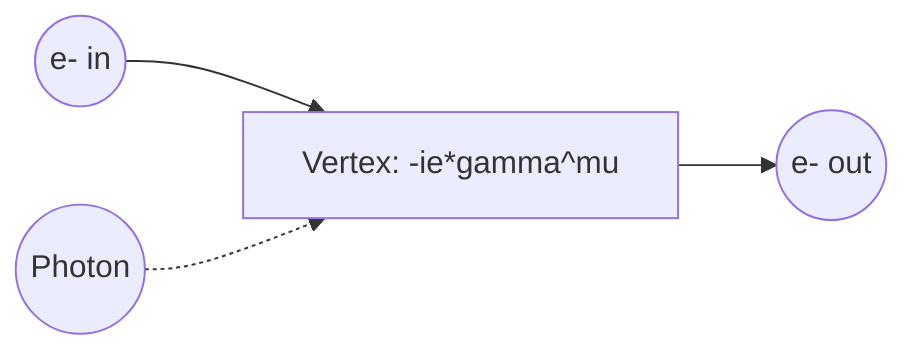

Host 1: Today, we are diving deep into the core of Unit 4 of Advanced Quantum Mechanics: "The Hamiltonian in the Radiation Field." When we couple an atomic system to an electromagnetic radiation field, we start with the classical minimal coupling Hamiltonian for a non-relativistic electron of charge $q$ and mass $m$:

$$H = \frac{1}{2m}(\mathbf{p} - q\mathbf{A})^2 + V(\mathbf{r}) + H_r$$

Here, $\mathbf{A}$ is the vector potential and $H_r$ is the Hamiltonian of the free radiation field. If we expand this, we get the interaction Hamiltonian. But the real magic happens when we transition from semiclassical theory to quantum field theory.

Host 2: Exactly. In the semiclassical approach, we treat the atom quantum mechanically but keep the radiation field classical. Expanding that kinetic term gives us an interaction term:

$$H' = -\frac{q}{2m}(\mathbf{p} \cdot \mathbf{A} + \mathbf{A} \cdot \mathbf{p}) + \frac{q^2}{2m}\mathbf{A}^2$$

Under the Coulomb gauge, where $\nabla \cdot \mathbf{A} = 0$, the momentum operator commutes with the vector potential, meaning $\mathbf{p} \cdot \mathbf{A} = \mathbf{A} \cdot \mathbf{p}$. Also, for weak fields, the quadratic term $\frac{q^2}{2m}\mathbf{A}^2$ is exceptionally small, so we neglect it as a minor perturbation. This simplifies our interaction Hamiltonian to:

$$H' = -\frac{q}{m}\mathbf{A} \cdot \mathbf{p}$$

Host 1: Right! And when we calculate transition matrix elements like $\langle s | H' | n \rangle$, we often use the electric dipole approximation. Since atomic dimensions are on the order of $10^{-10}\text{ m}$ and optical wavelengths are much larger—around $10^{-7}\text{ m}$—the spatial phase factor $e^{i\mathbf{k} \cdot \mathbf{r}}$ in the vector potential is approximately $1$ because $\mathbf{k} \cdot \mathbf{r} \ll 1$.

Host 2: That approximation simplifies things beautifully. To find the matrix element of the momentum operator $\mathbf{p}$, we use a clever commutator relation with the unperturbed atomic Hamiltonian $H_a = \frac{p^2}{2m} + V(\mathbf{r})$:

$$[\mathbf{r}, H_a] = \frac{i\hbar}{m}\mathbf{p} \implies \mathbf{p} = \frac{m}{i\hbar}[\mathbf{r}, H_a]$$

Taking the matrix element between eigenstates $|n\rangle$ and $|s\rangle$ of $H_a$, we get:

$$\langle s | \mathbf{p} | n \rangle = \frac{m}{i\hbar} (E_n - E_s) \langle s | \mathbf{r} | n \rangle = i m \omega_{sn} \langle s | \mathbf{r} | n \rangle$$

This elegantly links the momentum matrix element directly to the electric dipole transition matrix element of the position operator $\mathbf{r}$. Let's summarize the key differences between the Semiclassical and Quantum Field approaches:

| Feature | Semiclassical Theory | Quantized Radiation Field (QED) |
| :--- | :--- | :--- |
| **Vector Potential $\mathbf{A}$** | Classical wave function: $\mathbf{A}_0 \cos(\mathbf{k}\cdot\mathbf{r} - \omega t)$ | Operator: $\sum_\lambda \sqrt{\frac{\hbar}{2\epsilon_0 \omega_\lambda V}} (a_\lambda e^{i\mathbf{k}\cdot\mathbf{r}} + a^\dagger_\lambda e^{-i\mathbf{k}\cdot\mathbf{r}})\hat{\epsilon}_\lambda$ |
| **Transitions** | Induced absorption and induced emission only | Induced absorption, induced emission, and **spontaneous emission** |
| **Field Energy State** | Continuous energy density | Discrete Fock states: $|n_1, n_2, \dots\rangle$ with eigenvalues $\sum_\lambda (n_\lambda + \frac{1}{2})\hbar\omega_\lambda$ |

Host 1: Spontaneous emission is the ultimate proof that the semiclassical theory is incomplete! Without quantizing the field, you can't explain why an atom in an excited state decays to a lower state in the absence of an external classical electromagnetic field. The vacuum fluctuations—arising from that zero-point energy $\frac{1}{2}\hbar\omega$—are what drive spontaneous decay.

Host 2: Indeed. And to describe these interactions systematically at higher orders of perturbation theory, we must employ the S-matrix formalism and Dyson's time-ordered expansion. The time-evolution operator $U(t, t_0)$ in the interaction picture is solved iteratively to yield the Dyson series:

$$U(t, t_0) = 1 + \sum_{n=1}^{\infty} \left(\frac{-i}{\hbar}\right)^n \frac{1}{n!} \int_{t_0}^t dt_1 \dots \int_{t_0}^t dt_n P\left[H_I(t_1) H_I(t_2) \dots H_I(t_n)\right]$$

where $P$ is the Dyson chronological (time-ordering) operator. It ensures that fields acting at earlier times are applied to the state vector first.

Host 1: That time-ordering operator is vital because fields at different times do not necessarily commute. This series directly translates into Feynman diagrams, which map out these complex multidimensional integrals into intuitive graphical vertices. Here is a simple representation of a basic quantum electrodynamics (QED) vertex:

Host 2: In this diagram, the meeting point of a fermion line and a photon line is the vertex, which carries a factor of $-ie\gamma^\mu$ in covariant perturbation theory. This acts as the fundamental building block for calculating scattering cross-sections.

Host 1: Exactly. For example, in Thomson scattering—which is classical, low-energy limit scattering of light by a free charged particle ($\omega \ll m$)—the cross-section is independent of frequency:

$$\sigma_{\text{Thom}} = \frac{8\pi}{3} r_0^2$$

where $r_0 = \frac{e^2}{4\pi m}$ is the classical electron radius. But if the photon energy is comparable to or larger than the rest mass of the electron, we enter the relativistic regime of Compton scattering, described by the quantum-mechanical Klein-Nishina formula.

Host 2: This transition from low-energy classical Thomson scattering to high-energy quantum Compton scattering perfectly demonstrates why Unit 4 is so crucial. It bridges the gap between classical electromagnetism and relativistic quantum field theory!

Host 1: That's all the time we have for this deep dive. Keep deriving, pay close attention to those gauge choices, and we'll see you in the next advanced physics discussion!