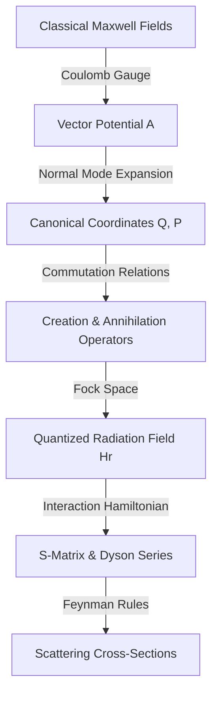

## Expert-Level Summary: Advanced Quantum Mechanics – Unit IV

### Core Concepts and Mathematical Foundations

Unit IV establishes the formal framework of **Quantum Electrodynamics (QED)**, transitioning from semi-classical radiation theory to fully quantized field theory. It begins with a non-relativistic electron of charge $q$ in an electromagnetic field, yielding the interaction Hamiltonian:

$$H' = -\frac{q}{m}\mathbf{A} \cdot \mathbf{p}$$

where the $A^2$ term is neglected as a small perturbation, and the Coulomb gauge ($\nabla \cdot \mathbf{A} = 0$) enforces $[\mathbf{A}, \mathbf{p}] = 0$. 

To address transitions, the semi-classical theory utilizes the **electric dipole approximation** ($e^{\pm i \mathbf{k} \cdot \mathbf{r}} \approx 1$, valid for atomic dimensions $r \sim 10^{-10}\text{ m}$ and optical wavelengths where $kr \ll 1$). This permits the evaluation of transition matrix elements using the fundamental commutation relation:

$$[x, H_a] = \frac{i\hbar}{m} p_x \implies \langle s | p_x | n \rangle = \frac{m}{i\hbar}(E_n - E_s) \langle s | x | n \rangle$$

To fully quantize the electromagnetic field, the vector potential $\mathbf{A}(\mathbf{r},t)$ is expanded into canonical normal modes, transforming the field into an infinite collection of independent quantum harmonic oscillators with the Hamiltonian:

$$H_r = \sum_{\lambda} \left( n_\lambda + \frac{1}{2} \right) \hbar\omega_\lambda$$

This introduces the creation ($a^\dagger_\lambda$) and annihilation ($a_\lambda$) operators, which act on Fock states $|n_1, n_2, \dots\rangle$ to describe photon emission and absorption.

---

### Covariant Perturbation Theory and Scattering

To maintain relativistic covariance, **Covariant Perturbation Theory** employs Dirac's interaction picture. The time-evolution operator $U(t, t_0)$ is derived via the **Dyson Series**:

$$U(t, t_0) = \sum_{n=0}^{\infty} \frac{(-i)^n}{n!} \int_{t_0}^{t} dt_1 \dots \int_{t_0}^{t} dt_n P[H_I(t_1) \dots H_I(t_n)]$$

where $P$ is the Dyson chronological (time-ordered) product operator. The **Scattering Matrix ($S$-matrix)** is defined in the infinite limits:

$$S = U(+\infty, -\infty)$$

This formalism is systematically calculated using **Feynman Rules**, mapping complex mathematical integrals to intuitive spacetime diagrams.

#### Key Scattering Processes Compared

| Scattering Process | Physical Description | Core Formula / Cross-Section | Key Physical Properties |
| :--- | :--- | :--- | :--- |
| **Thomson Scattering** | Classical, low-energy scattering of electromagnetic waves by a free charged particle. | $\sigma_{\text{Thom}} = \frac{8\pi}{3} r_0^2$ where $r_0 = \frac{e^2}{4\pi m}$ | No frequency shift ($\omega' = \omega$); sets the classical baseline. |
| **Compton Scattering** | Relativistic quantum scattering of a photon by a charged fermion. | $\frac{\omega'}{\omega} = \left[1 + \left(\frac{\hbar\omega}{mc^2}\right)(1 - \cos\theta)\right]^{-1}$ | Quantum frequency shift; governed by the **Klein-Nishina** formula at high energies. |
| **Møller Scattering** | Relativistic electron-electron scattering ($e^- e^- \rightarrow e^- e^-$). | Governed by $s, t, u$ **Mandelstam variables** | Exhibits distinct **crossing symmetry** ($t \leftrightarrow u$) due to identity of particles. |

---

### Academic Significance

This unit serves as the crucial mathematical bridge between non-relativistic quantum mechanics and relativistic quantum field theory. By unifying Maxwell's equations with quantum mechanical operators through gauge-invariant Lagrangians ($\mathcal{L} = -\frac{1}{4}F_{\mu\nu}F^{\mu\nu}$), it establishes the foundational toolkit for high-energy particle physics and modern QED calculations.