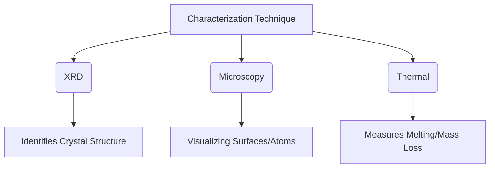

This guide breaks down "Characterization Techniques" into simple, manageable pieces. These tools are the "eyes" of scientists, helping them look at tiny materials, check their purity, and understand how they are built.

---

### 1. Chapter Overview
Characterization techniques are methods used to study the structure, composition, and physical properties of materials. Think of it like a medical check-up for materials—we use X-rays, microscopes, and heat tests to see what a substance is made of and how it behaves.

### 2. Key Concepts
*   **X-Ray Diffraction (XRD):** Uses X-rays to identify the internal atomic structure (like a fingerprint for crystals).
*   **Microscopy (SPM, SEM, TEM):** Uses probes or electron beams to take "pictures" of surfaces at the atomic level.
*   **Thermal Analysis (TGA, DTA, DSC):** Measures how a material changes as we change its temperature (e.g., melting or burning).
*   **Spectroscopy (UV-VIS):** Uses light to find out how much of a specific substance is in a solution.

### 3. Definitions and Terminology
| Term | Simple Definition |
| :--- | :--- |
| **Crystalline** | A solid where atoms are arranged in a neat, repeating pattern. |
| **Amorphous** | A solid where atoms are messy and have no repeating pattern (like glass). |
| **Endothermic** | A process that *absorbs* heat (the sample gets cooler). |
| **Exothermic** | A process that *releases* heat (the sample gets hotter). |
| **Resolution** | The ability of a microscope to show two close objects as separate points. |

### 4. Important Points
#### Bragg’s Law (The heart of X-ray diffraction)
When X-rays hit atoms in a crystal, they bounce off at specific angles. This constructive interference follows Bragg's Law:
$$n\lambda = 2d \sin \theta$$
*   $n$: Integer (1, 2, 3...)
*   $\lambda$: Wavelength of the X-ray
*   $d$: Spacing between atomic layers
*   $\theta$: Angle of the X-ray beam

#### How Microscopy Works
*   **SEM (Scanning Electron Microscope):** Scans the *surface* to see 3D-like shapes.
*   **TEM (Transmission Electron Microscope):** Shoots electrons *through* a thin sample to see internal details (like seeing the bones inside an X-ray).

### 5. Common Mistakes
1.  **Confusing TGA and DTA:** Remember, **TGA** measures *mass change* (burning off water or gas), while **DTA/DSC** measures *heat change* (melting or phase transitions).
2.  **Sample Prep:** Thinking you can just put anything into an electron microscope. Most need to be very clean, very small, and sometimes coated in metal to work properly.
3.  **Units:** Forgetting that wavelengths are usually in Angstroms (Å) or nanometers (nm). 

### 6. Exam Tips
*   **Draw Diagrams:** If asked about a technique, draw the simple flow (e.g., Source -> Sample -> Detector). It scores extra points!
*   **Keywords Matter:** Use words like "Constructive Interference" for XRD, "Electron Beam" for SEM/TEM, and "Phase Change" for DSC.
*   **Focus on Applications:** Teachers love asking "Which technique would you use to..." (e.g., use TGA to find moisture content in coal).

### 7. Quick Revision: Comparison Table

| Technique | What does it measure? | Best used for... |
| :--- | :--- | :--- |
| **XRD** | Atomic spacing ($d$) | Identifying minerals/chemicals |
| **SEM** | Surface topography | Looking at shape/size of small particles |
| **TGA** | Mass vs. Temperature | Checking thermal stability/moisture |
| **DSC** | Heat flow vs. Temperature | Finding melting point or purity |

**Encouragement:** This topic is all about technology that allows us to see the invisible. Don't worry about memorizing every single component. Focus on the **Goal** (What am I trying to see?) and the **Mechanism** (How does it get there: Light? Heat? Electrons?). You’ve got this!