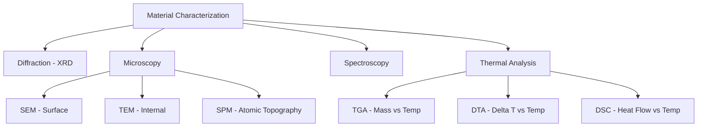

This chapter explores various analytical techniques used in material science to determine the structure, composition, and physical properties of materials. The techniques cover diffraction, microscopy, spectroscopy, and thermal analysis methods, all of which are essential for material characterization at atomic or molecular levels.

---

## 1. Key Concepts
*   **X-Ray Diffraction (XRD):** Uses constructive interference of monochromatic X-rays with crystal planes to identify structure and phase.
*   **Scanning Probe Microscopy (SPM):** Achieves atomic-scale resolution by scanning a sharp physical probe over a sample surface (includes STM and AFM).
*   **Scanning Electron Microscopy (SEM):** Uses a focused electron beam to visualize surface topography and composition through emitted secondary/backscattered electrons.
*   **Transmission Electron Microscopy (TEM):** Uses transmitted electron beams to provide highly magnified images of internal structures of thin specimens.
*   **Absorption Spectroscopy (UV-Vis-NIR):** Exploits the interaction of light (electromagnetic radiation) with matter to determine concentration or structural properties based on Beer-Lambert law.
*   **Thermal Analysis (TGA, DTA, DSC):** Analyzes changes in material properties (mass, enthalpy, heat capacity) as a function of temperature.

---

## 2. Definitions and Terminology

| Term | Definition |
| :--- | :--- |
| **Bragg’s Law** | The condition for constructive interference: $$n\lambda = 2d \sin\theta$$ |
| **Goniometer** | An instrument used to maintain the angle and rotate the sample in XRD. |
| **Tunneling Current** | Current that varies exponentially with the distance ($d$) between tip and sample in STM. |
| **Beer-Lambert Law** | Relates absorbance, concentration of absorbers, and path length. |
| **Thermogram** | A plot of mass vs. temperature in TGA. |
| **Endothermic** | Processes that absorb heat (e.g., melting, dehydration). |
| **Exothermic** | Processes that release heat (e.g., crystallization, oxidation). |

---

## 3. Important Points

### X-Ray Diffraction
*   **Principle:** Crystalline substances act as 3D diffraction gratings.
*   **Bragg Equation:** $$n\lambda = 2d \sin\theta$$, where $d$ is the spacing of lattice planes.
*   **Sample Prep:** Powdered samples must have randomly oriented crystallites to ensure all diffraction directions are attained.

### Scanning Probe Microscopy (STM vs. AFM)
*   **STM:** Operates on the principle of electron tunneling. Highly sensitive to the distance between tip and sample.
*   **AFM:** Monitors forces (van der Waals, electrostatic) between probe and sample. Uses a cantilever that deflects according to Hooke’s Law.

### Thermal Analysis
*   **TGA (Thermogravimetric Analysis):** Monitors mass change as temperature increases. Useful for determining thermal stability and decomposition.
*   **DTA (Differential Thermal Analysis):** Records the temperature difference ($\Delta T$) between sample and reference. Used for phase change analysis.
*   **DSC (Differential Scanning Calorimetry):** Measures heat flow differences between specimen and reference. Calculates transition enthalpy using $\Delta H = KA$.

---

## 4. Common Mistakes
1.  **Mixing up Microscopy Modes:** Confusing SEM (surface topography via reflected/emitted electrons) with TEM (internal structure via transmitted electrons).
2.  **Thermal Analysis Confusion:** Forgetting that TGA cannot detect processes without mass change (e.g., melting, glass transition), whereas DTA and DSC can.
3.  **Bragg's Law variables:** Misidentifying $\theta$ in Bragg's law; remember it is the diffraction angle, and data is often collected as $2\theta$.

---

## 5. Exam Tips
*   **Conceptual Linkage:** Always remember the "Energy Source" for each technique:
    *   XRD: X-rays
    *   SEM/TEM: Electron beams
    *   UV-Vis: Ultraviolet/Visible light
    *   Thermal: Heat/Temperature-programmed furnaces
*   **Applications:** Memorize one specific application for each technique (e.g., Kidney stone analysis for XRD, virus structure for TEM).
*   **Mathematical Relations:** Be ready to apply $$n\lambda = 2d \sin\theta$$ for simple numerical problems involving $d$-spacings.

---

## 6. Quick Revision Flowchart (Instrumentation Basics)

---

## 7. Crucial Physical Constants & Formulas
*   **Bragg's Law:** $$n\lambda = 2d \sin\theta$$
*   **DSC Enthalpy:** $$\Delta H = KA$$ ($A$ = peak area, $K$ = calorimetric constant)
*   **Specific Heat Capacity:** $$C_p = \frac{q}{\Delta T}$$
*   **Wavelength Regions:**
    *   UV: 300 - 400 nm
    *   Vis: 400 - 765 nm
    *   NIR: 765 - 3200 nm