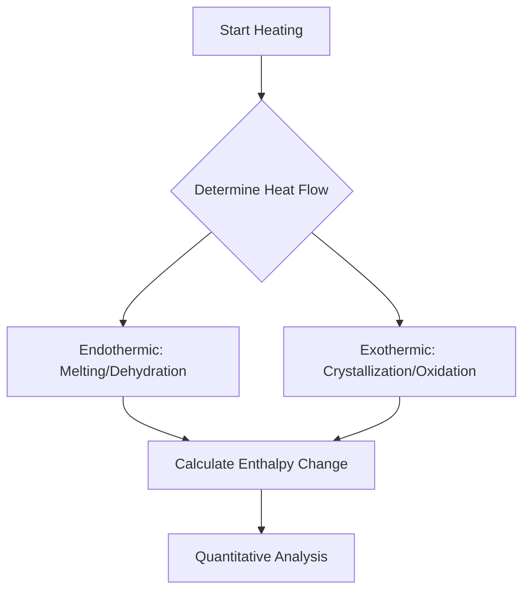

Host 1: Hey everyone! Welcome to our deep dive into the fascinating world of material characterization. If you've ever wondered how scientists actually "see" atoms, identify unknown minerals, or figure out what’s inside a kidney stone, you're in the right place. Today, we're breaking down those complex instruments you keep hearing about.

Host 2: That’s right! We’re covering everything from X-ray diffraction to the microscopic wonders of STM and AFM, and finally, those crucial thermal analysis methods like TGA and DSC. It sounds heavy, but it’s essentially the toolbox of modern physics and materials science. Let’s start with X-ray diffraction, or XRD.

Host 1: XRD is the superstar here. Think of it as using X-rays to fingerprint the internal structure of a crystal. The core concept is Bragg’s Law. When monochromatic X-rays hit a crystalline sample, they scatter. If they hit the atomic planes just right, they interfere constructively.

Host 2: Exactly, and the governing equation is one you absolutely need to memorize for your exams:
$$n\lambda = 2d \sin\theta$$
Where $n$ is an integer, $\lambda$ is the wavelength of the X-rays, $d$ is the distance between crystal planes, and $\theta$ is the scattering angle. If you get this equation wrong, your whole structural determination goes out the window!

Host 1: A common mistake students make is confusing the "powder" aspect. They think "powder" just means dust. In reality, it means the crystallites are randomly oriented, which is great because it ensures you get all possible diffraction directions at once.

Host 2: Moving on to the "micro" world! We’ve got Scanning Probe Microscopy (SPM), specifically STM and AFM. These aren't like your typical light microscopes. They use physical probes to scan surfaces.

Host 1: STM, or Scanning Tunneling Microscopy, is wild. It relies on the quantum mechanical effect of electron tunneling. Because the tunneling current decays exponentially with the distance between the tip and the sample, even a one-angstrom change in gap can change the current by an order of magnitude. It’s incredibly sensitive.

Host 2: AFM, or Atomic Force Microscopy, is a bit more versatile. Instead of tunneling current, it monitors the forces of attraction and repulsion between the probe and the sample. It’s got different modes: Contact, Non-contact, and Tapping mode. 

Host 1: And for our listeners, here’s a quick table to keep your microscopy concepts straight:

| Feature | STM | AFM |
| :--- | :--- | :--- |
| **Primary Interaction** | Quantum Tunneling | Physical Force (Van der Waals) |
| **Resolution** | Atomic scale | Atomic to micro scale |
| **Sample requirement** | Conductive surfaces | Any (solid, liquid, gas) |

Host 2: Don't forget Scanning Electron Microscopy (SEM) and Transmission Electron Microscopy (TEM). SEM gives us beautiful 3D-like images of surfaces using secondary electrons, while TEM lets us look *through* a specimen to see internal structures.

Host 1: TEM is basically the heavy lifter. It can magnify objects up to 2 million times. The preparation is tedious though—you need sections only 20-100 nm thin. If you don't stain them with heavy metals like lead citrate, you won’t get the contrast needed to see anything.

Host 2: Let's shift gears to thermal analysis. This is where we measure how materials behave when we heat them up. First, there's TGA—Thermogravimetric Analysis. It’s super straightforward: you plot mass versus temperature.

Host 1: TGA is perfect for finding the decomposition temperature of a substance. Remember, in your TGA graphs, the horizontal regions indicate stability, and the downward slopes signify weight loss due to things like dehydration or decomposition.

Host 2: If TGA is about mass, DTA—Differential Thermal Analysis—is about the heat flow. It measures the temperature difference ($\Delta T$) between your sample and an inert reference. If the process is endothermic, the sample stays cooler than the reference, giving you a dip in the curve. If it’s exothermic, you get a peak.

Host 1: And then there's the ultimate thermal tool: DSC, or Differential Scanning Calorimetry. It measures the difference in heat flow required to increase the temperature of a sample and a reference at the same rate.

Host 2: Let’s visualize that process in a quick flowchart:

Host 1: The most important takeaway for DSC is the enthalpy equation: $\Delta H = KA$. Here, $A$ is the area under the peak, and $K$ is the calorimetric constant. If you're asked to calculate energy, that's your go-to formula.

Host 2: Before we wrap up, let's address some common exam traps. Don't confuse "amorphous" with "crystalline" patterns in XRD. Crystalline materials show sharp Bragg peaks; amorphous materials show a broad, messy "hump."

Host 1: And for microscopy, always remember the trade-off: resolution vs. sample preparation. TEM gives the best resolution but requires the most brutal sample preparation. 

Host 2: Perfect. Just remember: Characterization is all about matching the right technique to the right question. Is it structural? Go XRD. Is it surface topography? Go STM/AFM. Is it heat stability? Use TGA or DSC. 

Host 1: That’s a wrap on our crash course! Study these equations, understand the instrumentation, and keep the differences between these techniques clear in your mind. Good luck with your studies!

Host 1: Wait, hold on! Before we actually sign off, I just realized we skimmed over one of the most frustrating parts of lab work: artifacts. Everyone studies the textbook versions of these graphs, but what happens when the machine spits out nonsense?

Host 2: Oh, you mean the "garbage in, garbage out" phenomenon? That’s such a crucial point. Students spend hours staring at a DSC baseline, wondering if their sample is melting or if the baseline is just drifting because the furnace wasn’t equilibrated.

Host 1: Exactly. Or take SEM, for instance. I remember my first time trying to image a non-conductive polymer. I didn’t sputter-coat it with gold, and I spent an hour trying to figure out why the image was just a blinding, static-filled white screen. Charging effects are the bane of every beginner’s existence.

Host 2: That’s a classic! It’s like trying to take a picture of a mirror in a dark room with a flash. The electrons have nowhere to go, so they just pile up on the surface and repel the incoming beam. The image effectively "explodes" with brightness. If you’re in an exam and they ask how to fix charging in SEM, the answer is always: "Apply a conductive coating or reduce the accelerating voltage."

Host 1: Right. And while we’re talking about artifacts, let’s bring up TGA again. People think a mass loss is always a chemical reaction. But what about buoyancy effects? If you heat a sample too fast, the gas density changes, and the balance thinks the sample is gaining weight—it’s essentially trying to float away.

Host 2: That’s a great nuance. It reminds me of the classic TGA error: the "mass gain" artifact. If you're running a TGA experiment and you see your sample mass increase significantly, you’re almost certainly dealing with a convection current or, heaven forbid, a leaky furnace. Always check the baseline run—the empty crucible run—before you trust your sample data.

Host 1: It’s basically like calibrating a scale at the grocery store. If the scale doesn't start at zero, your apples are going to cost a fortune. Speaking of instruments, let’s pivot to the "surface vs. bulk" divide. This is something professors love to put on finals. Why would you choose XPS over, say, EDX?

Host 2: XPS, or X-ray Photoelectron Spectroscopy, is purely a surface technique. It only probes the top 5 to 10 nanometers of your sample. If you’re looking at surface oxidation or how a thin film interacts with a substrate, XPS is your best friend. But if you want to know what’s happening in the core of a bulk material, you need something that penetrates deeper.

Host 1: Like EDX, which is often attached to an SEM. EDX can probe a few micrometers deep. It’s like comparing a security camera looking at the front porch versus a metal detector scanning the whole house. 

Host 2: Exactly. The penetration depth is the key variable. Think of it in terms of an analogy: If you want to know the quality of the paint on a car, you look at the surface. If you want to know if the engine block is made of iron or aluminum, the paint doesn’t matter—you need to dig deeper.

Host 1: I love that. Let’s extend that analogy. What about Raman vs. FTIR? They both tell you about chemical bonds, but they look at them in totally different ways. 

Host 2: Raman is all about the change in polarizability of the electron cloud, while FTIR—Fourier Transform Infrared Spectroscopy—is about the change in the dipole moment. If you’re looking at symmetric molecules, Raman is going to give you beautiful, crisp peaks where IR might show nothing at all.

Host 1: It’s the "Selection Rule" struggle. I had a professor who used to say, "If you want to understand the whole story, you need both." It’s like having a color-blind camera and a black-and-white camera. One highlights the shapes, the other highlights the colors. If you only use one, you miss half the picture.

Host 2: And don't forget sample preparation for those two! FTIR is notoriously easy—you just press your powder into a KBr pellet or put it on an ATR crystal. But Raman? You have to watch out for fluorescence. If your sample glows like a glow-stick under the laser, your spectrum is basically useless noise.

Host 1: That’s the worst. You turn on the laser, and the background just shoots up to infinity. The trick there is often changing the laser wavelength—moving from a visible green laser to a red or near-infrared one can often "dodge" the fluorescence. 

Host 2: You’re really getting into the weeds of troubleshooting now, but this is exactly what makes someone a good researcher. It’s not just memorizing the formula $\Delta H = KA$; it’s knowing *why* your DSC peak looks asymmetrical. Is it because the sample didn’t melt uniformly? Or is it a kinetic limitation because the heating rate was too aggressive?

Host 1: Slowing down the heating rate is the universal "magic fix," isn't it? If your peak is too broad, just slow down the ramp. If your transition is too messy, cool it down and run it again more slowly. 

Host 2: It’s like a conversation. If you talk too fast, you lose the details. If you heat the sample too fast, the thermal events overlap, and you lose the resolution of the phase transition. 

Host 1: Speaking of phase transitions, let’s circle back to XRD. I think a lot of students get confused about the difference between the Scherrer equation and the Bragg’s Law. Can we clear that up once and for all?

Host 2: Easy. Bragg’s Law, $n\lambda = 2d \sin \theta$, tells you *where* the peak is. It relates the diffraction angle to the atomic spacing, the $d$-spacing. It’s all about identifying *what* the crystal structure is. 

Host 1: And the Scherrer equation? That’s $D = K\lambda / (\beta \cos \theta)$. That tells you about the *size* of the crystals, right?

Host 2: Spot on. $\beta$ is the full-width at half-maximum of your peak. If your peaks are sharp, $\beta$ is small, which means $D$, the crystallite size, is large. If your peaks are broad, it means your crystals are tiny—or, as we said earlier, potentially amorphous.

Host 1: So, if I’m in the lab and I synthesize these beautiful gold nanoparticles, I want that peak to be broad?

Host 2: Exactly! If you want small particles, you want broad peaks. If you have a huge bulk piece of gold, you’ll get those satisfyingly sharp, thin needles on your XRD plot. 

Host 1: It’s funny how in this field, "broad" usually implies "bad" or "messy" data, but in nanotechnology, "broad" is actually a sign of success. It’s all about context.

Host 2: That is such a good point. Context is everything. It reminds me of the debate between "wet chemistry" and "instrumental analysis." Some people think if you can’t see it under a microscope, it didn’t happen. But you and I know that the most powerful insights often come from the indirect methods—the diffraction patterns and the thermal curves.

Host 1: True. Like, how can you "see" a hydrogen bond? You can't. But you can see its effect on the vibration of the molecule in an IR spectrum. You’re seeing the invisible.

Host 2: That sounds poetic, but it’s actually the literal truth of spectroscopy. We are measuring the energy states of atoms and electrons, and then translating that into something we can understand. It’s like translating a foreign language into English. The instrument is the translator.

Host 1: And if the translator is poorly calibrated, the meaning is lost. Let’s talk a bit about data processing. We’ve mentioned the hardware, but what about the software? Baseline correction, peak fitting—these are dangerous waters.

Host 2: Oh, the temptation to "fix" a baseline! Everyone has been there. You have a beautiful, clean peak, but the baseline is curved and makes your integration look terrible. So, you hit the "auto-baseline" button. 

Host 1: And suddenly, the peak has a weird tail, or part of the area is cut off. You’ve basically cheated. You haven’t improved the data; you’ve just hidden the imperfections.

Host 2: I had a teaching assistant who used to say that if you’re doing more than a linear baseline correction, you’re probably doing something wrong. If the baseline is truly non-linear, it usually means there’s an instrument issue that needs to be addressed at the source, not in the software.

Host 1: I think a lot of students think that the computer program knows better than they do. They trust the "Peak Fit" software to deconvolute overlapping signals. But if you have two overlapping peaks and you don't know the physical basis for that overlap, you’re just fitting noise to a mathematical function. You can fit a sine wave to a pile of rocks if you try hard enough.

Host 2: That’s a terrifying thought, but it’s true. Statistics are powerful, but they don't replace physics. If you have an overlapping peak in a DSC curve, ask yourself: is this a glass transition followed by an exothermic crystallization? Or is it just a bad furnace? Don't let the software decide for you.

Host 1: So, for the listeners out there who are currently staring at their data, what’s the hierarchy of trust? What do we rely on?

Host 2: Number one: The raw data. Always save the raw, unmodified file. You can always go back to it. Number two: The calibration standards. If your gold standard was off, your sample data is off. Number three: Your own physical intuition. If the machine says your polymer melted at 500 degrees, but you know it degrades at 300, don’t write down 500.

Host 1: I love that. "Don’t write down 500." It’s a simple rule, but it saves so many grades. How many times have we seen students turn in data that is physically impossible? 

Host 2: Too many. They’re so focused on the grade that they stop being scientists. They lose that critical eye. But look, that’s why we do these discussions, right? To remind everyone that instrumentation is just a tool, not an oracle.

Host 1: Exactly. Let’s shift gears one last time before we really, truly finish. Let’s talk about the future. What’s the next big thing in characterization? Are we moving away from these legacy techniques?

Host 2: I don't think we're moving away, but we’re definitely moving toward integration. Operando spectroscopy is the future. Instead of taking a sample out of the reactor and putting it in a vacuum, we’re now looking at the sample *while* it’s reacting, *while* it’s under high pressure, *while* it’s doing the work it was designed to do.

Host 1: Operando is incredible. It’s like watching a movie of the reaction instead of looking at a polaroid photo at the end. You get to see the transient species—the things that only exist for a microsecond. 

Host 2: And that’s where the real science is happening. It’s not about the final product; it’s about the journey of the molecules. 

Host 1: You know, for a subject that sounds so dry in a textbook—"Characterization of Materials"—it’s actually kind of like being a detective. You have these clues, these signals, these peaks, and you have to reconstruct the scene of the crime.

Host 2: Or the scene of the creation! Whether it’s a catalyst for clean energy or a new material for a foldable screen, we’re the ones figuring out what’s actually inside the box.

Host 1: I think we’ve covered enough ground to make anyone feel dangerous in a lab. We’ve hit the big ones: XRD for structure, TGA/DSC for thermal, SEM/TEM for imaging, and a little bit of the philosophy of data analysis.

Host 2: And remember the golden rule: if you don’t understand how the instrument works, you don’t understand your data. Read the manuals. Talk to the facility managers—they usually know more than the professors anyway.

Host 1: They definitely do. I once spent three days trying to fix a leak in a vacuum chamber, and it was the tech who walked in, tightened one screw, and looked at me like I was an idiot.

Host 2: (Laughs) I’ve been there. Everyone has been there. It’s a rite of passage. 

Host 1: Well, I think that’s the perfect place to leave it. A little humility, a lot of curiosity, and a deep respect for the equipment. 

Host 2: Couldn't have said it better myself. Now, get off the podcast and go finish those lab reports!

Host 1: Good luck out there, everyone. Keep digging, keep measuring, and most importantly, keep questioning the baseline. Catch you on the next one!

Host 2: Bye for now!

Host 1: Wait, one last thing. Did you double-check the audio levels on this? 

Host 2: (Laughs) Don't worry, the baseline is perfectly flat. We're good to go.

Host 1: Awesome. Fade to black.