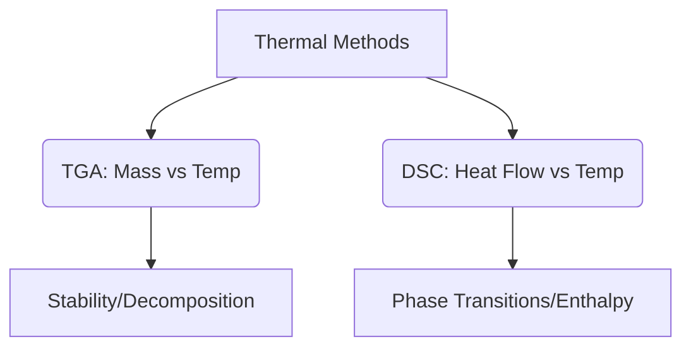

This video script is designed for a 3-minute educational summary of Characterization Techniques, focusing on clarity, visual engagement, and core physical principles for Class 10/11 level students.

---

### **Video Title: Exploring Materials: Characterization Techniques**
**Total Duration: 3:00**

---

### **Scene 1: Introduction to Material Characterization**
**Duration:** 20 seconds
**Visual Prompt:** Cinematic macro shot of a sleek, high-tech laboratory. Transition to a split-screen showing a diamond and a piece of graphite. The atoms in both structures are highlighted in a glowing 3D lattice, showing their different bonding patterns.
**Narration:** How do scientists look inside a material to understand its secrets? Characterization techniques are the tools that allow us to peek at the atomic structure, composition, and physical properties of everything from minerals to medicine.

---

### **Scene 2: X-Ray Diffraction (XRD)**
**Duration:** 45 seconds
**Visual Prompt:** Animation of an X-ray beam hitting a powder sample. The beam diffracts into concentric Debye-Scherrer rings. Show a diagram of Bragg’s Law: $n\lambda = 2d \sin\theta$. 
**Narration:** Powder X-ray Diffraction, or PXRD, is our primary tool for identifying crystalline structures. When X-rays hit a sample, they scatter. If the conditions satisfy Bragg’s Law, they create constructive interference, producing distinct peaks.

| Variable | Description |
| :--- | :--- |
| $n$ | Integer order of reflection |
| $\lambda$ | Wavelength of X-ray |
| $d$ | Interplanar spacing |
| $\theta$ | Diffraction angle |

**Narration:** By measuring the positions and intensities of these peaks, we identify the unique "fingerprint" of the material's crystal lattice.

---

### **Scene 3: Scanning Probe Microscopy (SPM)**
**Duration:** 40 seconds
**Visual Prompt:** A microscopic, needle-like tip scanning over a hilly, rugged atomic surface. Zoom in to show the "Feedback System" maintaining the tip-sample distance.
**Narration:** Scanning Probe Microscopy, including STM and AFM, works like a record player stylus, but at the atomic scale. A sharp probe scans the surface, using a feedback system to keep a constant interaction parameter, mapping the topography in three dimensions.

---

### **Scene 4: Scanning & Transmission Electron Microscopy (SEM/TEM)**
**Duration:** 45 seconds
**Visual Prompt:** Contrast an SEM image of a leaf surface (stomata) with a high-resolution TEM image showing the internal structure of a virus.
**Narration:** When light microscopes aren't enough, we use electrons. 
* **SEM:** Scans the surface to give us topographical depth. 
* **TEM:** Transmits a beam through a thin sample to reveal internal ultra-structures.
Because electrons have a much shorter wavelength than visible light, these microscopes can resolve details down to the nanometer scale.

---

### **Scene 5: Thermal Analysis (TGA & DSC)**
**Duration:** 30 seconds
**Visual Prompt:** A graph showing a weight-loss curve (Thermogram) as temperature increases. Transition to a DSC curve showing an endothermic melting peak.
**Narration:** Finally, we use Thermal Analysis. 
* **TGA** measures mass change as a function of temperature—perfect for studying decomposition. 
* **DSC** measures heat flow, helping us find melting points and phase transitions.

---

### **Scene 6: Conclusion**
**Duration:** 20 seconds
**Visual Prompt:** A montage of a scientist working in a lab, switching between an XRD screen, an electron microscope, and a computer analyzing a thermogram. Fade to the text: "Unlocking the Nano-World."
**Narration:** Whether it’s finding purity in medicine or understanding stress in airplane parts, these characterization techniques are the eyes of modern science. Understanding the structure is the first step to mastering the material.

---

**Physics Note for Students:**
* Remember, **XRD** depends on constructive interference: $n\lambda = 2d \sin\theta$.
* **SEM/TEM** leverage the wave-particle duality of electrons to overcome the diffraction limit of optical light.
* Always keep your sample dry and stable for accurate results!