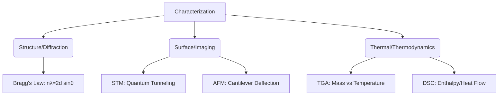

This document synthesizes the provided technical material into an advanced overview suitable for students preparing for competitive examinations such as the JEE Foundation, Olympiads, and advanced board curricula.

---

## 1. Chapter Overview
Material characterization is the field of physics and materials science concerned with probing the structure, composition, and properties of matter. This chapter transitions from diffraction-based techniques (probing periodic structure) to scanning probe techniques (probing surface topography/electronic states) and thermal analysis methods (probing thermodynamic transitions).

---

## 2. Key Concepts

### A. X-Ray Diffraction (XRD)
XRD relies on the constructive interference of monochromatic X-rays by crystalline planes.
*   **Bragg’s Law:** The fundamental condition for constructive interference:
    $$n\lambda = 2d \sin\theta$$
    *   $n$: Integer (order of reflection)
    *   $\lambda$: Wavelength of incident X-rays
    *   $d$: Interplanar spacing
    *   $\theta$: Angle of incidence/diffraction

### B. Scanning Probe Microscopy (SPM)
*   **Scanning Tunneling Microscopy (STM):** Exploits quantum tunneling. The tunneling current ($I$) decays exponentially with the tip-sample gap ($d$):
    $$I \propto V e^{-2\kappa d}, \quad \text{where } \kappa = \frac{\sqrt{2m\phi}}{\hbar}$$
    *   $\phi$: Average work function
    *   $m$: Mass of electron
*   **Atomic Force Microscopy (AFM):** Measures atomic-scale forces (van der Waals, electrostatic) using a cantilever deflection monitored by a laser-photodetector system.

### C. Thermal Analysis
*   **TGA:** Measures mass change as a function of temperature.
*   **DTA/DSC:** Measures enthalpy changes ($\Delta H$) or heat capacity ($C_p$).
    *   In DSC, the enthalpy of transition is related to the peak area ($A$):
        $$\Delta H = K \cdot A$$

---

## 3. Important Comparisons

| Technique | Physical Principle | Key Data |
| :--- | :--- | :--- |
| **PXRD** | X-ray constructive interference | Crystal structure, phase identification |
| **STM** | Quantum tunneling | Atomic resolution, Density of States (DoS) |
| **AFM** | Atomic forces (Hooke’s Law) | Surface topography, mechanical properties |
| **TGA** | Thermogravimetry | Thermal stability, mass loss/gain |
| **DSC** | Heat flow differential | Phase transitions, $\Delta H$, $C_p$ |

---

## 4. Important Points & Scientific Reasoning

*   **Diffraction Gratings:** Crystalline substances function as 3D diffraction gratings because their interatomic spacing is comparable to the wavelength of X-rays (Angstrom scale).
*   **Amorphous vs. Crystalline:** Amorphous materials lack long-range order; therefore, they yield broad "humps" in diffraction patterns rather than sharp Bragg peaks.
*   **Resolution Limit:** While optical microscopes are limited by the diffraction limit of light ($\approx 200\text{ nm}$), electron-based (TEM/SEM) and probe-based (STM/AFM) techniques bypass this by utilizing electrons (de Broglie wavelength $\lambda = h/p$) or physical probes.
*   **Electronic Stability:** Techniques like STM and TEM require vibration isolation and high vacuum to prevent electron-gas collisions and thermal noise interference.

---

## 5. Common Mistakes
1.  **Confusing 2$\theta$ and $\theta$:** In XRD, the detector rotates at $2\theta$ while the sample rotates at $\theta$.
2.  **Misinterpreting DTA/DSC Peaks:** Endothermic processes (melting, decomposition) appear as downward peaks (in some conventions) or minima in $\Delta T$, while exothermic processes (crystallization, oxidation) appear as upward peaks or maxima.
3.  **TGA Applicability:** TGA *cannot* detect phase transitions that involve no mass change (e.g., solid-solid transitions, glass transition temperature).

---

## 6. Exam Tips
*   **Memorize Bragg’s Law:** It is the most frequently tested equation. Practice calculating $d$ given $\lambda$ and $\theta$.
*   **Understand the "Exponential":** For STM, remember that the current is extremely sensitive to distance (1 Å change $\approx$ 1 order of magnitude in current).
*   **Link Concepts:** Always associate DSC with *Heat Flow* and TGA with *Mass Change*.

---

## 7. Quick Revision: Physics Principles

*   **Constants:** Cu $K\alpha$ radiation $\approx 1.5418\text{ Å}$.
*   **Rietveld Refinement:** Mathematical method to fit the entire diffraction profile to a structural model.
*   **SEM Mechanism:** Relies on secondary electron emission; brightness is proportional to the local electron yield, determined by topography.