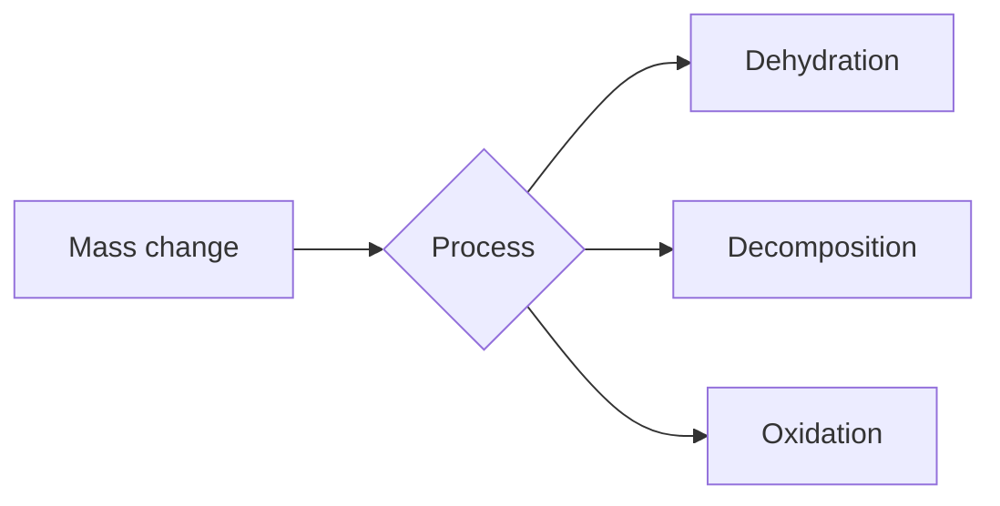

Host 1: Welcome back. Today, we’re dissecting "Characterization Techniques"—a foundational pillar for materials science, solid-state physics, and nanotechnology. It’s not just about looking at things; it’s about probing the interaction between energy—be it photons, electrons, or thermal flux—and the quantum or lattice structure of matter.

Host 2: Exactly. We’re moving beyond the simple "magnification" definition of a microscope. We’re looking at how we resolve the atomic architecture of a crystal or the molecular pathways of a polymer. Let's start with the workhorse: Powder X-ray Diffraction (PXRD). Why is "powder" actually a strategic advantage, rather than just a crude form?

Host 1: It’s purely a geometric necessity. In a single crystal, you only get diffraction from planes that satisfy the Bragg condition at specific orientations. By using a "powder"—which is essentially a collection of millions of tiny, randomly oriented crystallites—you guarantee that at any given angle $2\theta$, some subset of those crystallites is perfectly aligned to satisfy Bragg’s Law: $$n\lambda = 2d \sin\theta$$.

Host 2: And that leads to the concentric Debye-Scherrer rings. If the orientation wasn't random, those rings would just be discrete spots. But there’s a deeper physics point here: phase identification. Diamond and graphite are both allotropes of carbon, right?

Host 1: Right, their diffraction patterns are drastically different because their unit cells are distinct. In graphite, the inter-planar spacing ($d$) is much larger than in the rigid $sp^3$ network of diamond. Since the intensity and position of these peaks are directly tied to the lattice parameters ($a, b, c$), we aren't just taking a picture; we are performing an inverse Fourier transform of the reciprocal lattice into real space.

Host 2: Let’s contrast this with the Rietveld method. When we have peak overlap in complex structures, we can’t just eyeball it. We use a least-squares refinement to minimize the difference between the observed intensity $Y_i$ and the calculated intensity $Y_{ci}$. 

| Feature | PXRD | Rietveld Refinement |
| :--- | :--- | :--- |
| **Input** | Raw intensity vs. $2\theta$ | Structural Model + Raw Data |
| **Goal** | Phase Identification | Precise Lattice/Atomic Parameters |
| **Limitation** | Peak Overlap | Requires an approximate starting model |

Host 1: Exactly. Moving to microscopy—Scanning Probe Microscopy (SPM) changed everything in the 80s. STM doesn't use lenses. It uses quantum tunneling. The tunneling current $I$ depends exponentially on the barrier width ($d$) and the work function ($\phi$): $$I \propto V e^{-A\sqrt{\phi}d}$$.

Host 2: That "exponential" part is the key to its resolution. A change of just one angstrom in the gap $d$ changes the current by an order of magnitude. This makes the feedback loop in an STM incredibly sensitive. The piezoelectric scanner moves the tip in real-time to keep $I$ constant, effectively "tracing" the electron density of the surface.

Host 1: And then there's the distinction between SEM and TEM. SEM is about the topography of the surface—it’s like a sophisticated digital camera using a focused electron beam. TEM, however, is a transmission technique. You’re looking at the internal structure of thin foils. You need that specimen to be $<100$ nm thick, otherwise, the electrons are just absorbed.

Host 2: Right, the resolution limit of a light microscope is capped by the wavelength of visible light (~400–700 nm). In TEM, because the de Broglie wavelength of an electron ($\lambda = h/p$) is so tiny, we reach resolutions of $0.2$ nm or better. It’s the difference between seeing a grain of rice and seeing the atoms inside it.

Host 1: Let's pivot to thermal analysis: TGA and DSC. These aren't visual; they are thermodynamic probes. In Thermogravimetric Analysis (TGA), you’re measuring mass change as a function of temperature ($T$).

Host 2: The "idealized" TGA curve has regions of stability and regions of decline. But TGA misses things like phase transitions—melting doesn't change mass. That’s where Differential Scanning Calorimetry (DSC) comes in. It measures heat flow. If a material undergoes a phase change like melting, it absorbs energy without a temperature rise—that’s the latent heat of fusion.

Host 1: And the area under that DSC endothermic peak is exactly proportional to the enthalpy change $\Delta H$. The equation $$\Delta H = KA$$ where $K$ is the calibration constant and $A$ is the area, allows us to calculate the energy stored in the crystal lattice. 

Host 2: To synthesize all of this: characterize the structure (XRD), map the atomic surface (STM), image the internal morphology (TEM), and then measure the thermal stability (TGA/DSC). It’s an integrated approach.

Host 1: And the HOTS (Higher Order Thinking Skills) component here? Why does a polymer show a glass transition temperature ($T_g$) on a DSC curve but no latent heat peak? 

Host 2: Because $T_g$ is a second-order transition; there’s a change in heat capacity, but no sudden release or absorption of latent heat like you'd get with a first-order melting transition. It's a change in the mobility of the polymer chains, not a structural transformation of the lattice.

Host 1: Spot on. The physics of characterization is the physics of how we force matter to reveal its internal rules. Whether it's the constructive interference of X-rays or the quantum mechanical tunneling of electrons, the math is the map. Thanks for joining us for this deep dive.

Host 1: Hold on, don’t sign off just yet. I think we’ve barely scratched the surface of how those "internal rules" govern failure. We talked about how to map the material, but we haven’t discussed why the map sometimes leads us to a cliff. Why does a material that behaves perfectly under an XRD scan suddenly shatter like glass under impact?

Host 2: You’re talking about the transition from ductile to brittle behavior, right? The classic “Ductile-to-Brittle Transition Temperature,” or DBTT. It’s the ghost in the machine of metallurgy. You can have the perfect crystal lattice, exactly as the XRD predicted, but if the temperature drops, the dislocation movement—that beautiful "plasticity" we love—gets frozen out.

Host 1: Exactly. It’s like a ballroom dance. At room temperature, the dislocations are the dancers, sliding past each other, absorbing energy, making the material "tough." But lower the temperature, or increase the strain rate, and suddenly the music stops. The dislocations can’t move, and the material has no choice but to cleavage. It’s a literal atomic stalemate.

Host 2: I love that analogy. And it ties back into the characterization we were just talking about, doesn't it? If you’re designing a bridge in a sub-zero climate, you don’t just look at the lattice structure in a warm lab. You have to account for the impact energy—the Charpy V-notch test. You’re essentially testing the "social skills" of those dislocations under pressure.

Host 1: And that leads us to the most frustrating part of materials science: fatigue. You can have a material that is perfectly safe according to all your static tests, but give it a million tiny, sub-critical oscillations, and it creates a crack that eventually runs away. It’s a cumulative history of microscopic trauma.

Host 2: It’s the "death by a thousand cuts" phenomenon. The crack tip is a stress concentrator, right? Even if the bulk material is fine, the tip of that crack is a singularity. Every time the load cycles, the plastic zone at that tip undergoes a tiny bit of deformation, eventually propagating the crack forward, one micrometer at a time. It’s like a slow-motion unraveling of the atomic bonds.

Host 1: And that’s where the "math as a map" becomes a survival guide. We use Paris’s Law to predict the crack growth rate. It’s a beautiful power law, linking the stress intensity factor range to the actual growth increment. It’s one of the few places in physics where you can actually watch entropy winning, day by day, in a piece of metal.

Host 2: It’s humbling, isn’t it? We spend all this time trying to engineer perfect, static structures, but the universe is inherently dynamic and, frankly, aggressive. Everything wants to revert to a state of lower energy. Oxidation, corrosion, fatigue—it’s all just nature reclaiming our fancy alloys.

Host 1: Speaking of corrosion, that’s another "rule" that isn't captured by a simple XRD scan. You can have a perfect crystal, but if you have a localized electrochemical cell—a bit of impurity, a grain boundary with a slightly different potential—that’s your ignition point. It’s not just about the chemistry; it’s about the geography of the surface.

Host 2: The "geography" of the surface—I like that. It’s like a landscape. The grains are the mountains, the grain boundaries are the valleys. If you have an electrolyte sitting in those valleys, you’ve essentially built a micro-battery. You get pitting, you get stress-corrosion cracking. The characterization challenge there is that the damage is often hidden. You need acoustic emission sensors to "hear" the cracks forming internally before they reach the surface.

Host 1: Acoustic emission is such a cool field. It’s like giving the material a voice. It’s literally listening to the atomic bonds snapping. If you place a transducer on a steel beam, you can hear the internal stress relief as a series of pops and clicks. It’s the material literally screaming that it’s reached its limit.

Host 2: It’s like a geological survey, but for a turbine blade. You’re listening for the “earthquakes” inside the alloy. But let’s zoom out for a second. We’ve been talking about the failure of metals. What about the move toward additive manufacturing? If we’re "printing" our materials layer by layer, are we changing the rules of the game entirely?

Host 1: Oh, absolutely. When you use a laser to melt metal powder—Selective Laser Melting—you’re creating a micro-welding zone that moves at lightning speed. The cooling rates are astronomical, sometimes a million degrees per second. You aren’t getting a standard equilibrium crystal structure. You’re getting a highly non-equilibrium state, often with residual stresses that would make a conventional metallurgist break into a cold sweat.

Host 2: So, the XRD patterns for additive parts look different? 

Host 1: They’re often broadened. You have massive dislocation densities and "frozen-in" defects that simply don’t exist in a cast or forged part. The "map" is much, much noisier. You have to use advanced techniques like Synchrotron X-ray diffraction just to decipher the chaotic mess of the residual stress profile.

Host 2: It’s like trying to read a manuscript that someone’s been scribbling over with a permanent marker. But the trade-off is the geometry. You can print internal cooling channels in a turbine blade that are impossible to machine. You’re sacrificing the "perfection" of the lattice for the "intelligence" of the design.

Host 1: That’s the core tension of modern materials science, isn’t it? The struggle between the material’s intrinsic potential and the engineer’s desire for complexity. We’re moving away from the era of "pick the best alloy from the handbook" to "design the alloy from the ground up, atom by atom." Computational Materials Science—CALPHAD, density functional theory—it’s turning the Periodic Table into a LEGO set.

Host 2: I remember the first time I ran a DFT simulation. You input the atomic positions, define the exchange-correlation functional, and hit 'run.' Then you wait. You’re essentially calculating the quantum mechanical energy landscape of the electrons. It’s the ultimate way to predict if a material will exist before you ever step foot in a lab.

Host 1: It’s the "digital twin" of the crystal. You can test a million variations of a high-entropy alloy—mixing five or six elements in different ratios—on a supercomputer, and only synthesize the one that actually looks stable. It saves years of trial and error. It’s the difference between exploring a new continent by walking and exploring it via satellite.

Host 2: But even with all that power, we still rely on the TGA/DSC, the XRD, the TEM. The simulation gives you the "what," but the lab gives you the "truth." I’ve seen simulations predict a perfectly stable phase, only for the experiment to show the material decomposing at 400 degrees because of some trace impurity that the simulation didn’t account for.

Host 1: A classic case of "garbage in, garbage out." Or, more accurately, "idealization in, reality out." The simulation assumes a vacuum, a perfectly clean environment. Real life has humidity, oxygen, defects, grain boundaries, and the occasional idiot operator who leaves the sample out on the bench overnight.

Host 2: (Laughs) The "Human Factor" is the most unpredictable variable in any materials lab. I once spent a week trying to get a thin film to grow correctly, only to realize the sputtering target had a tiny scratch in it. That scratch was enough to seed a defect that propagated through the whole film. 

Host 1: The "Butterfly Effect" of thin-film deposition. It really drives home the point that in materials science, the microscopic *always* dictates the macroscopic. You cannot cheat the scale. If the atoms aren't happy, the part fails. 

Host 2: And that brings us back to the idea of "higher order thinking." It’s not just about knowing that the XRD peaks are there; it’s about knowing *why* they might be shifting. If the peak shifts to a lower angle, the lattice has expanded—maybe there’s a residual tensile stress, or maybe you’ve doped the lattice with a larger atom. You have to be a detective, constantly asking, "What could have caused this specific signature?"

Host 1: It’s detective work, for sure. You have to synthesize the history of the sample. "How was it processed? How long was it heated? What was the cooling rate?" Each process leaves a fingerprint on the structure. The characterization isn't just a snapshot; it's a forensic report.

Host 2: I think that’s why I love TEM so much. When you’re looking at a high-resolution TEM image, you’re looking at individual atomic columns. You’re literally seeing the material’s DNA. You can see where a dislocation line terminates, where a vacancy is, where a precipitate has formed to pin the grain boundary. It’s the ultimate validation.

Host 1: And yet, even there, you’re looking at a tiny, tiny window. A TEM sample is maybe 100 nanometers thick. Is that representative of the bulk? It’s the fundamental dilemma of the field: we gain resolution at the cost of the "big picture." We see the trees so clearly that we sometimes lose track of the forest.

Host 2: That’s why we need that integrated approach we talked about earlier. XRD for the bulk, TEM for the interface, SEM for the topography. You have to stitch those perspectives together to get the real story. If you rely on one, you’re seeing a flat projection of a multi-dimensional reality.

Host 1: It’s like the fable of the blind men and the elephant. The one touching the leg says it’s a pillar; the one touching the trunk says it’s a snake. We’re the blind men, but our tools are getting better. We’re finally starting to see the whole elephant.

Host 2: And once we see the whole elephant, what do we do with it? We build things. We build better solar cells that can capture more light because we’ve engineered the bandgap. We build more efficient catalysts because we’ve mapped the surface active sites. We build faster chips because we’ve mastered the art of atomic layer deposition. 

Host 1: It’s the "Materialization of Technology." Every technological leap in human history—from the Bronze Age to the Silicon Age—has been defined by what we could craft out of the earth. We’re in the middle of a "Material Renaissance" right now. We’re no longer limited by what nature provides; we’re limited by our own ability to imagine the structure.

Host 2: That’s a powerful thought. "Imagining the structure." It’s basically architecture, but at the scale of angstroms. When I think about it that way, the lab doesn't feel like a chore. It feels like a studio. We’re artists, just using a different medium.

Host 1: I’ll take that. But even the best artist needs a frame. The "frame" for us is the physics—the laws of thermodynamics, the kinetics of diffusion, the quantum mechanics of bonding. Without those, we’re just splashing color on a canvas. With them, we’re engineers.

Host 2: And what a canvas it is. The range of properties is mind-blowing. You go from a material that’s soft enough to flow like honey to a ceramic that’s hard enough to cut diamond, all based on the arrangement of the same subatomic building blocks. It’s the ultimate modular system.

Host 1: Have you ever thought about why some materials are so incredibly complex? Like, why is a high-temperature superalloy so much harder to characterize than, say, pure aluminum? 

Host 2: Because it’s a mess! It’s designed to be a mess. You’ve got a gamma-prime phase in a gamma matrix, with refractory elements added to slow down diffusion, and trace elements to keep the grain boundaries from slipping. It’s a chaotic harmony of different phases all working together. If you were to look at it under a standard microscope, you’d just see a blur. You need to use advanced diffraction to separate the signals of the different phases.

Host 1: It’s like a piece of jazz. It’s not a simple, clean, classical melody. It’s syncopated, layered, complex. And if you remove one instrument, the whole thing falls apart. That’s why characterization is so hard—you’re trying to understand the jazz without being able to see the individual musicians clearly.

Host 2: That’s a perfect way to put it. The "musicians" are the elements. If you tweak the concentration of Rhenium by even a fraction of a percent, the whole "composition" of the microstructure shifts. You can go from a stable, high-performance alloy to one that develops cracks in minutes just by being off-tempo.

Host 1: And the scary part is, we’re now pushing these materials to their absolute limits. We’re operating turbines at temperatures where the metal is essentially "sweating." It’s so close to its melting point that the atoms are almost ready to hop out of their lattice sites. We’re keeping them in place with the sheer force of our microstructural engineering. 

Host 2: It’s a high-wire act. We’re balancing the physics of diffusion against the needs of the application. It’s constant maintenance. That’s why monitoring the health of these materials—the "nondestructive evaluation" we talk about—is becoming more important than the initial design. 

Host 1: Exactly. Sensors, digital twins, real-time feedback loops. The future of materials science isn't just creating the material; it’s being in a constant conversation with it. "How are you doing? Are you getting tired? Any fatigue developing at the grain boundaries?"

Host 2: A conversation with a piece of metal. It sounds crazy, but in a way, that’s exactly what it is. We’re trying to listen to what the material is telling us through its electrical resistance, its acoustic signature, its thermal expansion. 

Host 1: It’s the ultimate relationship. You have to respect the material, treat it right, and understand its limits. If you do that, it’ll take you to the edge of the atmosphere and back. If you don't… well, you've seen the debris fields. 

Host 2: I think that’s the real takeaway here. The science of materials isn't just a set of techniques for a lab report. It’s a way of looking at the physical world. Everything is composed of these rules, these invisible structures. Once you start seeing them, you can’t look at a bridge, a phone, or a jet engine the same way again.

Host 1: You stop seeing the "thing" and start seeing the "process." You see the casting, the heat treatment, the machining, the micro-stresses. It’s like you’ve been given a pair of X-ray glasses. It’s the best kind of nerd-vision.

Host 2: (Laughs) Nerd-vision. I’ll take it. But seriously, it makes life so much more interesting. Every object has a story to tell. And it’s our job to be the ones who can read the script.

Host 1: So, what’s next on our reading list? We’ve covered the lattice, the defects, the failure modes, the computational side. Where do we go from here? 

Host 2: I think we need to talk about biomimicry. Nature has been doing materials science for four billion years, and it hasn't used a single high-temperature vacuum furnace. Look at spider silk. It’s stronger than steel by weight, flexible, and synthesized at room temperature in water. How does nature "characterize" and "engineer" its materials without the equipment?

Host 1: Oh, that’s a deep rabbit hole. Nature uses proteins as the templates. It doesn’t use "bulk processing"; it uses self-assembly. It builds the structure one molecule at a time, governed by the folding patterns of the amino acids. It’s the ultimate bottom-up fabrication.

Host 2: It’s "Materials by Design" in its purest form. And we’re only just beginning to replicate it. We’re trying to synthesize peptide-based polymers that fold into specific shapes, just like spider silk proteins. We’re copying the homework, but we’re still not quite as fast as the original.

Host 1: That’s the next frontier. Merging the synthetic, inorganic precision of our current techniques with the organic, self-assembling intelligence of nature. Imagine a material that could heal itself, like a bone. If a crack forms, the "micro-vascular" network inside the material pumps a monomer to the site, fills the crack, and polymerizes.

Host 2: That’s the dream: the "Living Material." You wouldn't need to monitor it; it would monitor itself. It would be a self-healing, self-reinforcing, sentient piece of engineering. We’re moving from the Age of Steel to the Age of Responsive Matter.

Host 1: It’s a long road from here to there. But that’s the beauty of it. We’ve got the map, we’ve got the tools, and we’ve got the curiosity. And as long as we keep asking "why," we’ll keep finding new ways to push the boundaries of what’s possible.

Host 2: I think that’s a perfect place to pause. We’ve gone from the crystal lattice to the future of sentient alloys. It’s been quite a ride.

Host 1: The map is still unfolding, and there’s so much more territory to explore. But for today, I think we’ve filled enough of the whiteboard. 

Host 2: Agreed. The labs are waiting, the samples are prepped, and the machines are running. Let’s get back to the real work.

Host 1: Thanks again for sharing these insights. It’s one thing to know the definitions in a textbook, but another to understand the "why" behind them. 

Host 2: Any time. Let’s keep digging into the atomic mystery. It’s the only way we’ll ever build the future. 

Host 1: Until next time, keep your eyes on the microscope and your mind on the mechanics. 

Host 2: And remember, if the peaks shift, there’s always a reason. You just have to be curious enough to find it. 

Host 1: Exactly. Class dismissed! 

Host 2: (Laughs) See you in the lab!